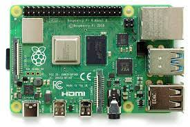
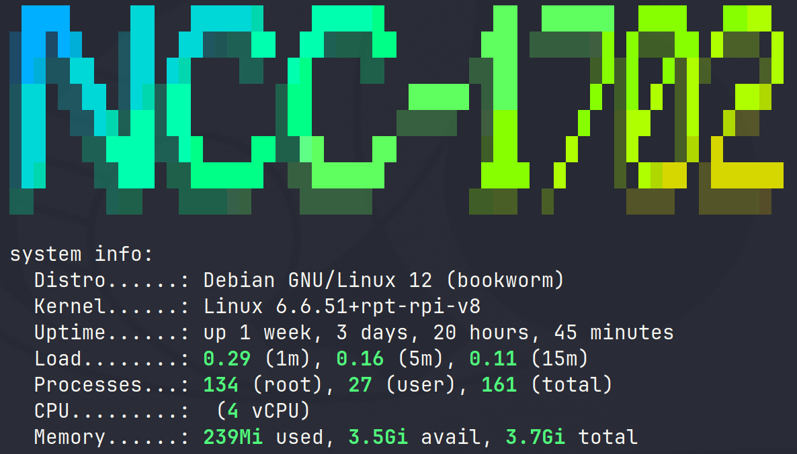
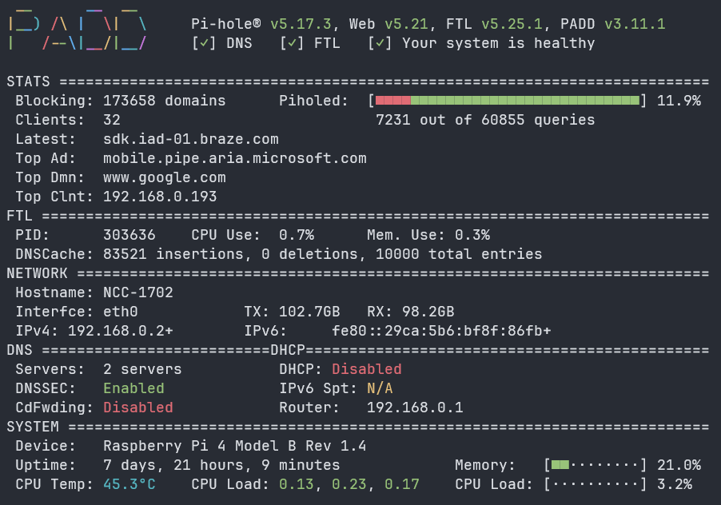

NCC-1702 is my primary DNS resolver and also provides ad-blocking through Pi-Hole

It is a Raspberry Pi4 4GB and is strapped to the back of the offical Raspberry Pi 7" screen which displays Pi-Hole stats through PADD

Along with Pi-Hole and as already mentioned within the [Overview](https://docs.xmsystems.co.uk/overview/) section, I have also installed Pi-VPN which uses Wireguard to provide a fast & secure VPN connection back to my home network.  
As it works hand-in-hand with Pi-Hole, I also get ad-blocking on the go.

Pi-Hole's web interface allows a Star Trek LCARS Theme to be applied (hence the play on the hostname)

