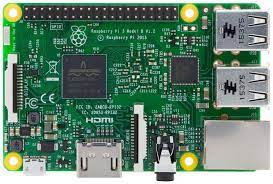
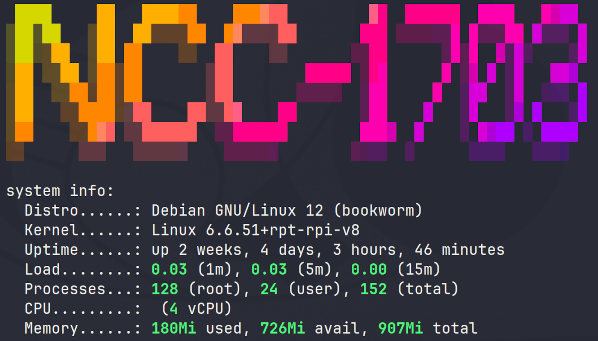

ncc-1703 is my secondary or alternate DNS resolver and runs on a Raspberry Pi3

This also provides ad-blocking through Pi-Hole and its Web Interface also has the same Star Trek LCARS Theme. Like NCC-1702, it is paired with [Unbound](unbound.md) as a local recursive DNS resolver.

