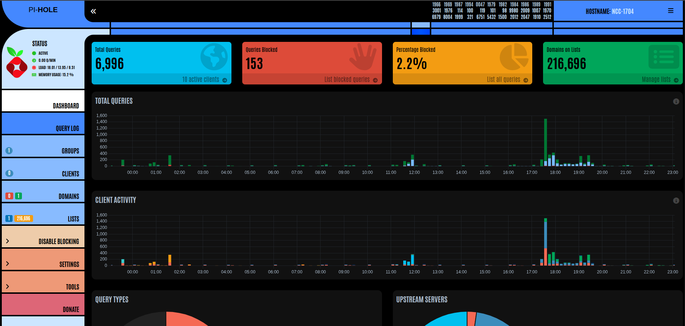

NCC-1704 is a tertiary Pi-Hole instance but this one runs in docker.



This container has a very simply configuration and runs in host network mode.

```yaml
services:
  pihole:
    container_name: pihole3
    hostname: NCC-1704
    image: pihole/pihole:latest
    network_mode: host
    environment:
      TZ: Europe/London
    volumes:
      - /ssd/docker/appdata/pihole/etc-pihole:/etc/pihole
      - /ssd/docker/appdata/pihole/etc-dnsmasq.d:/etc/dnsmasq.d
    restart: unless-stopped
```

To ensure I can use my domain to reach the dashboard, I have added the regex middleware config to the dynamic file called config.yml and have also created a dynamic file that specifies the domain and calls the middleware.

You can see these in the [Traefik - Dynamic Files](https://docs.xmsystems.co.uk/dynamic/) page

I have also updated the config for [Nebula-Sync](https://docs.xmsystems.co.uk/nebula-sync/) to ensure this is also kept in sync with the other 2 Pi-Holes


