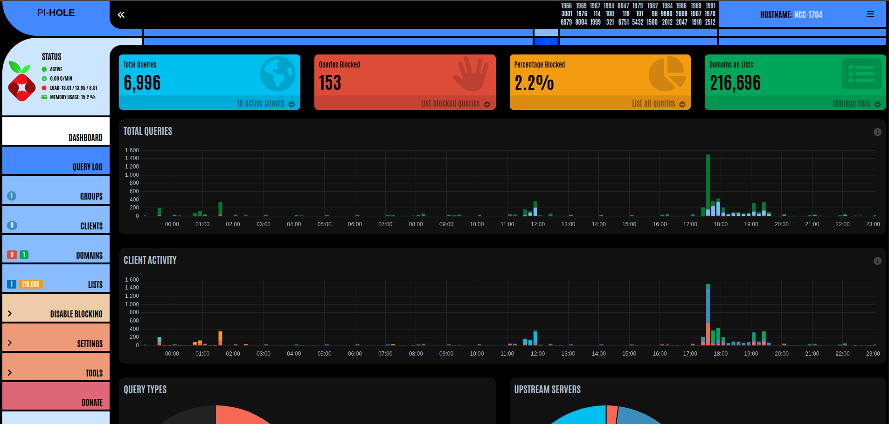

# NCC-1704

NCC-1704 is a tertiary Pi-Hole instance running in Docker, now paired with [Unbound](unbound.md) as a recursive DNS resolver.



Rather than forwarding DNS queries to an upstream provider like Cloudflare or Google, Unbound resolves them directly by walking the DNS hierarchy from the root nameservers. This means no third-party resolver ever sees your query traffic — Pi-hole handles ad/tracker blocking, and Unbound handles the resolution itself.

The two services share a private Docker network (`phobos-network`) with static IPs. External devices send DNS queries to Pi-hole at the Docker host's IP on port 53 (exposed via the `ports:` mapping). Pi-hole then forwards upstream queries to Unbound internally at `unbound#53` (`172.20.0.4`), which external devices never interact with directly.

## docker-compose.yml

```yaml
networks:
  phobos-network:
    external: true

services:
  unbound:
    image: mvance/unbound:latest
    container_name: unbound
    restart: unless-stopped
    networks:
      phobos-network:
        ipv4_address: "172.20.0.4"
    volumes:
      - /ssd/docker/appdata/pihole/unbound/root.hints:/opt/unbound/etc/unbound/root.hints:ro

  pihole:
    container_name: pihole3
    hostname: ncc-1704
    image: pihole/pihole:latest
    depends_on:
      - unbound
    networks:
      phobos-network:
        ipv4_address: "172.20.0.3"
    ports:
      - 80:80
      - 443:443
      - 53:53/tcp
      - 53:53/udp
      - 123:123/udp
    environment:
      - TZ=Europe/London
      - FTLCONF_webserver_api_password=
      - FTLCONF_dns_upstreams=unbound#53
    volumes:
      - /ssd/docker/appdata/pihole/etc-pihole:/etc/pihole
      - /ssd/docker/appdata/pihole/etc-dnsmasq.d:/etc/dnsmasq.d
    restart: unless-stopped
    cap_add:
      - SYS_TIME
      - SYS_NICE
```

### Dynamic File

To ensure I can use my domain to reach the dashboard, I have added the regex middleware config to the dynamic file called config.yml and have also created a dynamic file that specifies the domain and calls the middleware.

You can see these in the [Traefik - Dynamic Files](https://docs.xmsystems.co.uk/dynamic/) page

I have also updated the config for [Nebula-Sync](https://docs.xmsystems.co.uk/nebula-sync/) to ensure this is also kept in sync with the other 2 Pi-Holes
