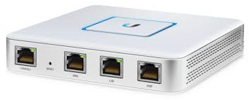

!!!info
    RETIRED!

As previously mentioned, my router and access points are Unifi.



I only have a Unifi Security Gateway and don't yet have a Dream Machine or a CloudKey, so I selfhost my controller in Docker.  This used to be a simple image but now it utilises a MongoDB database.

Migrating all my data across to the new image with database was fairly simple.  I took a full backup of my current setup from within the controllers UI.  The controller was shut-down and the new image with database was then installed

Instructions for installation of this have been taken from github:

[unifi-network-application](https://github.com/linuxserver/docker-unifi-network-application)

## MongoDB

I setup MongoDB seperately and as advised, I have pinned the version to 4.4.  

###init-mongo.js

As I have set this up seperately, I created the necessary init script (javascript file) to create my user.  This was then attached to the container as a read-only bind mount. 

```js
db.getSiblingDB("MONGO_DBNAME").createUser({user: "MONGO_USER", pwd: "MONGO_PASS", roles: [{role: "dbOwner", db: "MONGO_DBNAME"}]});
```
### docker-compose.yml

``` yaml
networks:
  default:
    name: cuthbert-network
    external: true

services:
  mongodb:
    image: docker.io/mongo:4.4
    container_name: mongodb
    networks:
      default:
        ipv4_address: "172.22.0.3"
    volumes:
      - /home/xander/appdata/mongodb/data/db:/data/db
      - /home/xander/appdata/mongodb/init-mongo.js:/docker-entrypoint-initdb.d/init-mongo.js:ro
    restart: unless-stopped
    healthcheck:
      test: echo 'db.runCommand("ping").ok' | mongo localhost:27017/test --quiet
      interval: 10s
      timeout: 10s
      retries: 5
      start_period: 40s
```

## unifi-network-application
### docker-compose.yml

```yaml
networks:
  default:
    name: cuthbert-network
    external: true
 
services:
  unifi-controller:
    image: lscr.io/linuxserver/unifi-network-application:latest
    container_name: unifi-network-application
    networks:
      default:
        ipv4_address: "172.22.0.2"
    environment:
      - PUID=1000
      - PGID=1000
      - TZ=Europe/London
      - MONGO_USER=<username specified in init.js>
      - MONGO_PASS=<password specified in init.js>
      - MONGO_HOST=<mongodb container name>
      - MONGO_PORT=27017 #mongodb port
      - MONGO_DBNAME=<dbname specified in init.js>
    restart: unless-stopped
    ports:
      - 8443:8443
      - 8080:8080
      - 10001:10001/udp
      - 3478:3478/udp
    volumes:
      - /home/xander/appdata/unifi:/config
```

### Dynamic File

As this is running on a seperate host to where Traefik is running, I have created a Dynamic file to have it routed through Traefik and with SSL.

That Dynamic file can be located [here](https://docs.xmsystems.co.uk/dynamic/#unifi-cuthbert)
!!!info
      This file no longer exists and has been replaced with [Unifi UCG](https://docs.xmsystems.co.uk/dynamic/#unifi-ucg)

Once installed, I was then able to navigate to the DNS name I have specified.  
It is here where I am then able to restore the backup that I previously captured.


## Device Adoption

To be able to adopt other devices like an access point, the inform URL within the controller needs to be changed to something the device is able to see.  By default, it will be set to the Docker network IP Address and a device on the outside, won't be able to see this.

To do this within the controller, you need to navigate to:

***settings > system > advanced***

About half way down the page you will see the following option (ensure you set the address to the docker host (IP or Domain will work)) and tick the box to "Override" 


You can also manually adopt a device via SSH

``` bash
ssh ubnt@<device-address>
```
The default password for a Unifi Access Point will be ***ubnt***

Once connected, run the following command to allow the controller to adobt the device:

``` bash
set-inform http://<controller-address>:8080/inform
```

This should then appear within your list of devices


