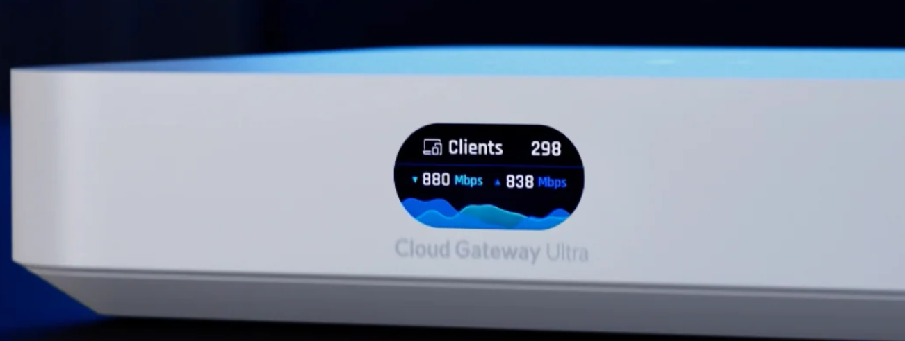
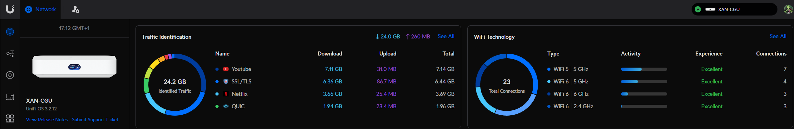

### Unifi Cloud Gateway Ultra (CGU)

As an interim measure, I have upgraded my USG to the new Unifi Cloud Gateway Ultra

I still intend on upgrading again to a UDM Pro and a Unifi enterprise PoE switch of somekind when I either get a new house or extend the property where I am currently ( still not decided yet )

This thing is awesome.  I no longer have to run a seperate mongodb and Unifi network application.  This has the network controller firmware built in.

Installing this has allowed me to revamp my network.  I've changed the IPv4 subnet that I use across my network.

I have now setup a /24 subnet using 10.36.100.0 subnet - The numbers here are relevant and memorable to me.

### Dynamic File

I do still need to specify a traefik dynamic file so that I can connect to the Network Controller firmware using my domain and SSL

This Dynamic File can be found [here](https://docs.xmsystems.co.uk/dynamic/#unifi-ucg)
  

