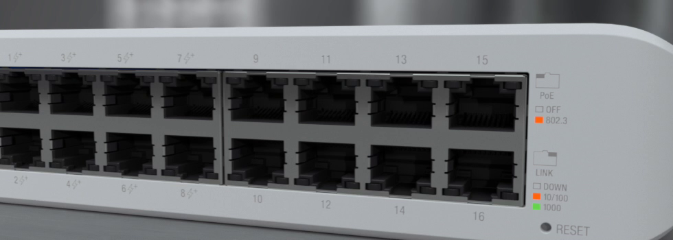

### Unifi USW Lite 16 PoE

Also as an interim measure, I have installed 2 of these Unifi Lite 16 port switches.
One for upstairs and one for downstairs.

Each provide 16 Gigabit ports with the first 8 ports offering PoE+

This has replaced multiple dumb, un-managed switches and has also allowed me to setup some VLAN's