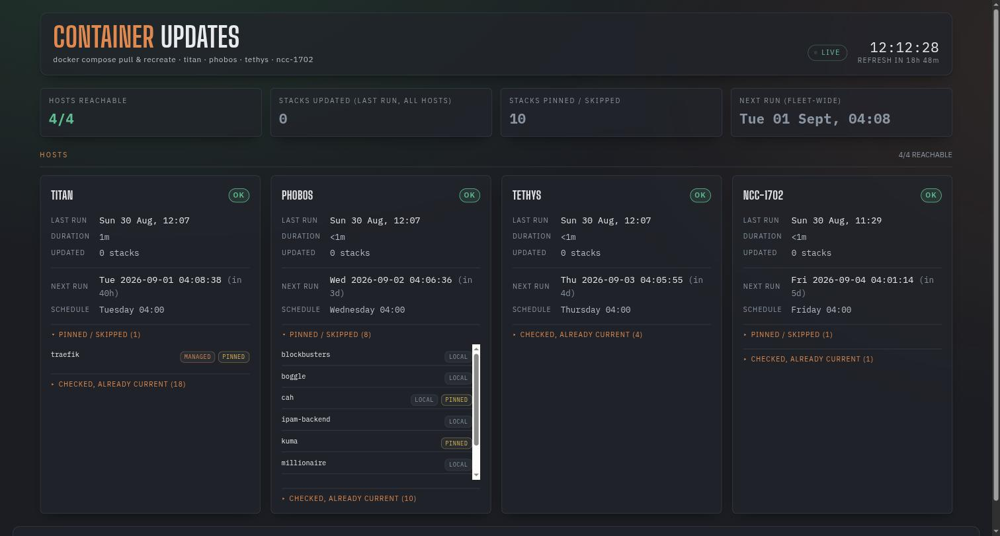

# Automatic Container Updates

`containers.xmsystems.co.uk` — shows what each host's weekly Docker Compose
update run actually did: which stacks got a new image (old → new), which
stacks are deliberately left alone (and why), and when each host's next run
is scheduled.



The update itself is not new — [`update-containers.sh`](docker.md) has
always pulled and force-recreated Compose stacks across titan, phobos,
tethys, and ncc-1702 on demand. What's new is running it **automatically**,
once a week per host, and reporting the result here instead of only in a
terminal.

## Schedule

Each host's container update runs the day **after** that same host's
[unattended-upgrades](unattended-upgrades.md) run, at 04:00, with the same
10-minute jitter and catch-up-if-missed behaviour:

| Host | Unattended-upgrades day | Container-update day |
| --- | --- | --- |
| Titan | Monday 03:00 | **Tuesday 04:00** |
| Phobos | Tuesday 03:00 | **Wednesday 04:00** |
| Tethys | Wednesday 03:00 | **Thursday 04:00** |
| NCC-1702 | Thursday 03:00 | **Friday 04:00** |

Packages settle first, containers follow the next day — the same reasoning
as staggering unattended-upgrades itself: if a bad update breaks something,
it's isolated to one host at a time and there's a full day between a
kernel/library update and a container recreate on the same box. NCC-1703
isn't in this schedule — it has no compose stacks (see [Pi-hole
Status](piholes.md)'s NCC-1703, which is a bare Pi-hole install).

## What it shows

A summary strip (hosts reachable, stacks updated across the fleet, stacks
pinned/skipped, next run), then one card per host:

- Last run time and duration
- **UPDATED** — one line per service that got a new image: old image
  digest → new digest (short SHA), and when it was pulled
- **PINNED / SKIPPED** — stacks the update deliberately leaves alone, each
  tagged with why
- **CHECKED, ALREADY CURRENT** — stacks that were pulled and compared but
  had nothing new
- **ERRORS**, when a pull or recreate failed for a stack

!!! note "Why digests instead of version numbers"
    Most images here are tagged `:latest` (or have no tag at all), so
    there's no semver to show — `:latest` doesn't change when a new image
    is published. The only reliable way to show "did this actually update,
    and to what" is the image's own digest (its content hash), read before
    and after the pull. A digest change is unambiguous proof of a new
    image; an unchanged digest means the pull found nothing new, even
    though the command still ran.

## Why some stacks are pinned or skipped

Only two kinds of stack are deliberately left out of the update-and-recreate
step — everything else, including the mysql instances and Portainer's own
agent, goes through `pull && up -d --force-recreate` like any other stack:

| Reason | Which stacks | Why |
| --- | --- | --- |
| `pinned` | Titan's `traefik`, Phobos's `kuma` | Pinned to an **exact patch release** (`traefik:3.7.12`, `uptime-kuma:2.5.3`) — a version bump here is a deliberate, tested decision, not something to apply blind and unattended |
| `local` | Phobos's `boggle`, `cah`, `trivial`, `blockbusters`, `millionaire`, `poker`, `ipam-backend` | Built from a local Dockerfile (`build:` in the compose file) — there's no registry image to pull, `docker compose pull` can't find anything newer regardless |

The mysql stacks (`titan-mysql-db`, `phobos-mysql-db`, `tethys-mysql-db`)
are **not** skipped, even though `mysql:8.4` looks like a pinned tag at a
glance — it's a floating *minor*-version tag that MySQL republishes with
each patch release (8.4.0 → 8.4.1 → …), so pulling it does pick up genuine
patch updates. Only a full `major.minor.patch` pin like `traefik:3.7.12`
stops receiving anything new under the same tag.

Reasons are classified dynamically by reading each skipped stack's own
compose file at run time (a `build:` key → local; a non-floating,
full-version tag → pinned), rather than hardcoded, so the label stays
correct if a compose file changes later. Titan's `traefik` stack also
bundles a `portainer-ee:lts` container in the same compose file — it rides
along as skipped too, simply because it's in the same stack, not because
Portainer itself is treated specially anymore.

## How it works

```text
Timer (per host, staggered day, 04:00)
  └─▶ docker-update-check (root, systemd oneshot)
        ├─▶ for each stack in that host's compose directory:
        │     skipped?  → classify reason from its compose file, record it
        │     otherwise → read each service's image digest
        │                 docker compose pull && docker compose up -d --force-recreate
        │                 read each service's image digest again, diff
        └─▶ writes /var/log/docker-updates/status.json
              └─▶ container-status-api (root systemd service, port 9881)
                    └─▶ nginx (Phobos) proxies /api/containers/<host>/
                          └─▶ Traefik (Titan) → containers.xmsystems.co.uk
```

This mirrors [unattended-upgrades' own dashboard
backend](unattended-upgrades.md#live-status-dashboard) exactly —
`container-status-api` is the same small per-host Python API pattern as
`update-status-api`, just reading a JSON file this update script writes
directly instead of parsing a log file. Compose base directories and
per-host skip lists are the same ones `update-containers.sh` already uses
(see its [README](docker.md) table) — kept in sync by hand between the two
scripts, since the manual tool and the scheduled one are separate files.

- Source: `docker-update-check.py` and `container-status-api.py` in the
  `update-containers` repo (`/home/xander/scripts/update-containers`),
  deployed as near-identical copies per host (only `HOST`, `BASE_DIR`, and
  `SKIP` differ) — the same convention `update-status-api` already uses.
- The update command itself is unconditional: `docker compose pull &&
  docker compose up -d --force-recreate` runs for every non-skipped stack
  on every run, whether or not its digest changed — identical to
  `update-containers.sh`'s existing behaviour. Digests are only read
  before/after for the report; they never gate whether the command runs.

!!! note "Running it on demand"
    ```bash
    ssh <host> sudo /usr/local/bin/docker-update-check
    ```
    Or, to preview without touching anything (pulls and diffs digests,
    skips the recreate step):
    ```bash
    ssh <host> sudo /usr/local/bin/docker-update-check --check-only
    ```

## Troubleshooting

- **A host shows "UNREACHABLE"** — its `container-status-api` service is
  down, or Phobos's nginx proxy to that host's port 9881 is failing. Check
  `systemctl status container-status-api` on that host.
- **A host shows "ERRORS"** — a stack's `pull` or `up -d --force-recreate`
  failed; check `journalctl -u docker-updates-weekly.service` on that host
  for the full stderr.
- **A stack you expected to update shows under "CHECKED, ALREADY CURRENT"**
  — its registry genuinely had nothing newer than what was already pulled;
  this is expected most weeks for most stacks.
- **Page looks stale** — check `systemctl list-timers
  docker-updates-weekly.timer` on the relevant host.

## Related

- [Unattended Upgrades](unattended-upgrades.md) — the OS-package equivalent
  this schedule is staggered against
- [Docker](docker.md) — the manual `update-containers.sh` tool and compose
  layout this automation is built on
- [Server Health](moon-fleet.md) — same visual theme, 4-hour static snapshot
- [Storage Monitoring](storage.md) — same visual theme, live-polled
