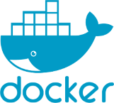

I like to host all of my services using docker.

## Installation

Installation of docker within Ubuntu Server is done so by following the instructions on the official docker documentation site  

- [Docker Docs](https://docs.docker.com/engine/install/)  

My servers are either running Ubuntu Server or Debian. Below are links to the official installation instructions for both.

- [Ubuntu](https://docs.docker.com/engine/install/ubuntu/#install-using-the-repository)
- [Debian](https://docs.docker.com/engine/install/debian/#install-using-the-repository)

Once installed, running `docker --version` should then return something similar to the following:  

  

## Network Configuration

Before spinning up some docker containers, I need to ensure I have setup my docker networks.

I use 4 docker networks (2 on titan, 1 on phobos & 1 on tethys)

### TiTAN

TiTAN runs a Reverse Proxy in the form of [Traefik](https://docs.xmsystems.co.uk/traefik/). To ensure that all applications (that need to be proxied) pass through Traefik, I would need to associate them with this network.

The creation of the network is a simple command and is one that specifies a subnet.  

The reason for specifying a subnet is so I can provide a static IP Address to each of my services.  This also assists with connectivity between containers and keeps everything organised.

```bash
docker network create --subnet 172.19.0.0/24 proxy
docker network create --subnet 172.18.0.0/24 monitoring
```  

This creates a /24 subnet named ***proxy*** and a /24 subnet named ***monitoring***

### Phobos

The "phobos-network" docker network has been created for all of the containers running on phobos  
Just like TiTAN containers, they have all been provided with static IP Addresses.
As this is a totally seperate system, I'm unable to associate docker containers here with the network that traefik is running on.  Therefore, any container that needs to run through traefik, a [dynamic file](https://docs.xmsystems.co.uk/dynamic/) needs to be created.   

```bash
docker network create --subnet 172.20.0.0/24 phobos-network
```  

This creates a /24 subnet named ***phobos-network***

### Tethys

Similally with Phobos, I also have created a docker network for containers running on Tethys.

```bash
docker network create --subnet 172.20.0.0/24 tethys-network
```
This creates a /24 subnet named ***tethys-network***  

## Docker Commands

I deploy all of my docker containers using docker compose.  

This is where I will write out everything the container needs in a YAML file.

To pull and deploy the image according to the details in the YAML, from the same directory as where the compose file resides, I would run the following command:

```bash
docker compose pull; docker compose up -d
```

The -d at the end will run the container ***detached*** meaning the terminal window can be closed and the container will continue running.

Should I need to make changes to my YAML configuration (change some environment settings or change the docker image being used), I can re-deploy the container with a similar command:

```bash
docker compose pull; docker compose up -d --force-recreate
```

This will ensure the container is re-created.

All of my compose files reside in the following locations

### TiTAN

```sh
/ssd/docker-compose/
├── arrs
│   └── docker-compose.yml
├── dozzle
│   └── docker-compose.yml
├── ghost
│   └── docker-compose.yml
├── ha
│   └── docker-compose.yml
├── homepage
│   └── docker-compose.yml
├── homers
│   └── docker-compose.yml
├── it-tools
│   └── docker-compose.yml
├── navidrome
│   └── docker-compose.yml
├── overseerr
│   └── docker-compose.yml
├── plex
│   └── docker-compose.yml
├── podgrab
│   └── docker-compose.yml
├── ppe
│   └── docker-compose.yml
├── sabnzbd
│   └── docker-compose.yml
└── tautulli
    └── docker-compose.yml

14 directories, 14 files
```

### Phobos

```sh
/ssd/docker/docker-compose/
├── checkmk
│   └── docker-compose.yml
├── cloudflare
│   └── docker-compose.yml
├── dockpeek
│   └── docker-compose.yml
├── dozzle-agent
│   └── docker-compose.yml
├── frigate
│   └── docker-compose.yml
├── headscale
│   └── docker-compose.yml
├── kuma
│   └── docker-compose.yml
├── mkdocs
│   └── docker-compose.yml
├── monitoring
│   └── docker-compose.yml
├── motioneye
│   └── docker-compose.yml
├── nebula-sync
│   └── docker-compose.yml
├── nginx
│   └── docker-compose.yml
├── pihole
│   └── docker-compose.yml
├── portainer
│   └── docker-compose.yml
├── ubuntu
│   └── docker-compose.yml
├── vaultwarden
│   └── docker-compose.yml
└── wazuh-agent
    ├── config
    │   └── wazuh-agent-conf
    └── docker-compose.yml

10 directories, 11 files
```

### Tethys

```sh
/home/xander/docker/docker-compose/
├── checkmk
│   └── docker-compose.yml
├── dozzle-agent
│   └── docker-compose.yml
└── portainer
    └── docker-compose.yml

3 directories, 3 files
```
Across all hosts, you will see here that there are numerous services listed that are not mentioned or detailed within this documentation site.
These are services/applications that I am still either testing or refining.

If I plan on implmenting them log term then I will be creating pages for these.