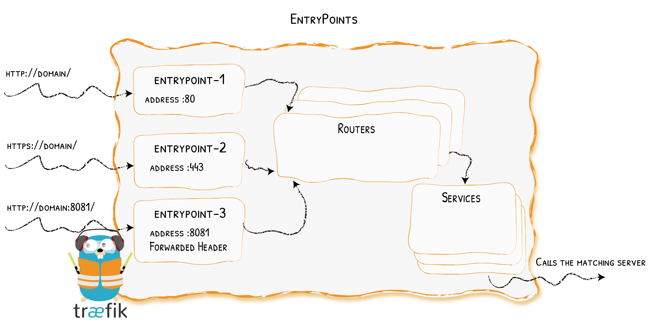

EntryPoints are the network entry points into Traefik. They define the port which will receive the packets, and whether to listen for TCP or UDP.

With my configuration, I have setup 4 entrypoints  


##External EntryPoints

The external entrypoints are for my external services and have been setup on non-standard ports.  
In order for this to work, I have had to create the following port-forwarding rules within my router

http & https requests would come in on their standard ports of 80 & 443.  The port forwarding rules will take these request that comes in on ports 80 & 443 and forward these to the local IP Address where Traefik is running on ports 81 & 444 respectively.


##Internal EntryPoints

The internal entrypoints are for my internal-only facing services and have been setup on http & https standard ports (80 & 443).  To be able to connect to and use these services, the device requesting the connection would need to reside on the Local Area Network or be connected to the VPN.

In order for this to work, I would still create my DNS A records with my domain provider in the usual way to specify the subdomain for the service.  (This will allow Lets Encrypt to still issue a valid certificate)  

I also need to create some local DNS records for the same subdomains to allow them to still route internally.  This is done within my Pi-Hole's.  I only need to create them on one Pi-Hole as Gravity Sync would then syncronise this across to the other.  

The local IP to specify here, would not be the IP Address of where the service is running, but the IP Address of where Traefik is running.


##Defining EntryPoints

The entrypoints themselves are defined in the [traefik.yml](https://www.xanlab.co.uk/traefik/#traefikyml) file.

##Selecting an EntryPoint to use

Telling each service what entrypoint they are to use is pretty straight forward.

###Labels

For services that run on the same host where traefik is installed, this is done with the use of Traefik Labels.

Below is an example section of the docker-compose file for Navidrome showing the different labels I have configured.  You can see the third one in the list is for "entrypoint" and its been specified as "websecure-int"

```yaml
labels:
            - traefik.enable=true
            - traefik.http.services.navidrome.loadbalancer.server.port=4533
            - traefik.http.routers.navidrome.entrypoints=websecure-int
            - traefik.http.routers.navidrome.rule=Host(`sudomain.domain.co.uk`)
            - traefik.http.routers.navidrome.tls=true
            - traefik.http.routers.navidrome.tls.certresolver=production
            - traefik.http.routers.navidrome.tls.domains[0].main=domain.co.uk
            - traefik.http.routers.navidrome.tls.domains[0].sans=*.domain.co.uk
```

###Dynamic File

For services that are running on a different host to where traefik is running, I can specify the entrypoint to use within the dynamic file I have setup for that service.

The example below, shows a basic dynamic file for Uptime-Kuma where I have specified the entry point as "websecure-ext"

```yaml
http:
  routers:
    kuma:
      entryPoints:
        - "websecure-ext"
      rule: "Host(`sudomain.domain.co.uk`)"
      tls:
        certResolver: production
      service: kuma

  services:
    kuma:
      loadBalancer:
        servers:
          - url: "http://192.168.0.199:3001"
        passHostHeader: true
```

!!! info
    Technically, I can still do this for services running on the same host as Traefik and omit the labels but I find it more straight forward to use labels where I am able to
