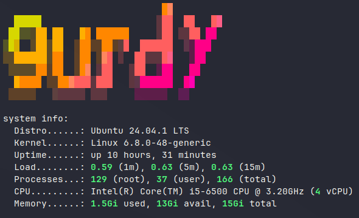

Gurdy is a dedicated host to serve [CheckMK](https://docs.xmsystems.co.uk/monitoring/#checkmk)

**Specs**

- HP 280 G2 SFF Business PC  
- Intel i5 6500 CPU  
- 16GB RAM (2 x 8GB)
- 250GB Samsung Evo SSD for OS

Operating System

My operating system of choice is Ubuntu Server
Current version - 24.04.1 LTS