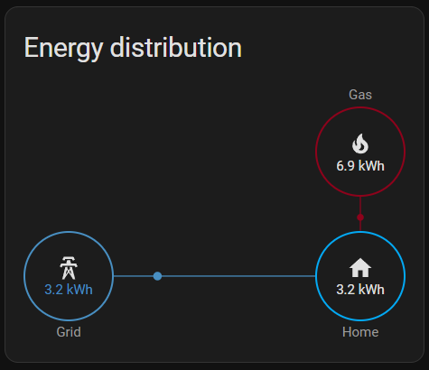

I've only just started with the whole smart home automation craze and its one I want to learn more about.

Currently, I have only setup the energy meter within home assistant so it can show me my electricity and gas usage but I have plans to add so much more.




docker-compose file location

``` bash
├─ ssd/
│  └─ docker-compose/
│     └─ ha/
```

Appdata

``` bash
├─ ssd/
│  └─ appdata/
│     └─ ha/
```

##docker-compose.yml

``` yaml
networks:
  default:
    name: proxy
    external: true

services:

  homeassistant:
    image: ghcr.io/home-assistant/home-assistant:stable
    container_name: home-assistant
    networks:
      default:
        ipv4_address: 172.19.0.222
    ports:
      - 8123:8123
    environment:
      - PUID=1000
      - PGID=1000
      - TZ=Europe/London
    volumes:
      - /ssd/appdata/ha/config:/config
    #devices:
    #  - /path/to/device:/path/to/device #optional
    restart: unless-stopped
    labels:
       - traefik.enable=true
       - traefik.http.services.ha.loadbalancer.server.port=8123
       - traefik.http.routers.ha.rule=Host(`subdomain.domain.co.uk`)
       - traefik.http.routers.ha.entrypoints=websecure-int
       - traefik.http.routers.ha.tls=true
       - traefik.http.routers.ha.tls.certresolver=production
       - traefik.http.routers.ha.tls.domains[0].main=domain.co.uk
       - traefik.http.routers.ha.tls.domains[0].sans=*.domain.co.uk
```