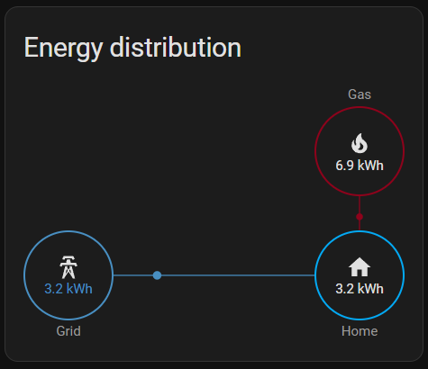

Home Assistant is my smart home automation hub. It started with just energy monitoring but has grown to include Zigbee lighting, temperature and humidity sensors, and Google Home integration via Nabu Casa.

---

### Zigbee

Zigbee devices are managed through ZHA (Zigbee Home Automation), using a **SMLIGHT SLZB-06U** coordinator connected via ethernet rather than USB, which keeps it off the host machine and avoids interference issues.

---

### Lights

All lights are Zigbee and managed through ZHA.

| Friendly Name | Model | Capabilities |
| --- | --- | --- |
| Big Light | Innr RB 282 C | Brightness + colour temperature |
| Table Lamp | Zigbee bulb | Brightness |
| Floor Lamp | Zigbee bulb | Brightness |

---

### Sensors

Two **eWeLink SNZB-02P** Zigbee temperature and humidity sensors are deployed:

| Friendly Name | Location | Measures |
| --- | --- | --- |
| Temp-LR | Living Room | Temperature (°C), Humidity (%) |
| Temp-DR | Dining Room | Temperature (°C), Humidity (%) |

---

### Energy Monitoring

Energy monitoring is provided by a **Hildebrand Glow (DCC)** smart meter bridge, which reads both the electricity and gas smart meters directly. Usage and cost data for today is surfaced as sensors within HA.



---

### Nabu Casa (Home Assistant Cloud)

Nabu Casa is enabled, which provides:

- **Remote access** — secure external access to the HA UI without needing to open ports
- **Google Home / Google Assistant** — all supported devices (lights, sensors) are exposed to Google and can be controlled by voice
- **Cloud TTS / STT** — text-to-speech and speech-to-text via the HA Cloud pipeline

---

### docker-compose.yml

``` yaml
networks:
  default:
    name: proxy
    external: true

services:

  homeassistant:
    image: ghcr.io/home-assistant/home-assistant:stable
    container_name: home-assistant
    networks:
      default:
        ipv4_address: 172.19.0.222
    ports:
      - 8123:8123
    environment:
      - PUID=1000
      - PGID=1000
      - TZ=Europe/London
    volumes:
      - /ssd/appdata/ha/config:/config
    restart: unless-stopped
    labels:
       - traefik.enable=true
       - traefik.http.services.ha.loadbalancer.server.port=8123
       - traefik.http.routers.ha.rule=Host(`subdomain.domain.co.uk`)
       - traefik.http.routers.ha.entrypoints=websecure-int
       - traefik.http.routers.ha.tls=true
       - traefik.http.routers.ha.tls.certresolver=production
       - traefik.http.routers.ha.tls.domains[0].main=domain.co.uk
       - traefik.http.routers.ha.tls.domains[0].sans=*.domain.co.uk
```
