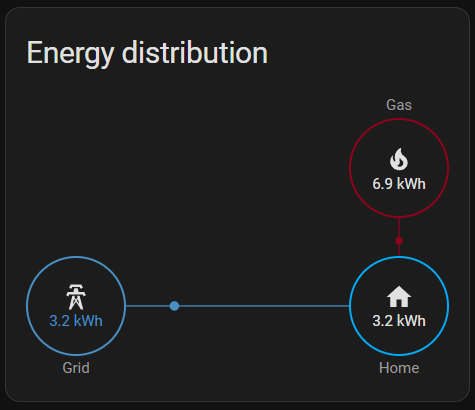

# Home Assistant


Home Assistant is my smart home automation hub. It started with just energy monitoring but has grown to include Zigbee lighting, temperature and humidity sensors, camera integrations, smart-appliance tracking, and Google Home integration via Nabu Casa.

---

## Zigbee

Zigbee devices are managed through ZHA (Zigbee Home Automation), using a **SMLIGHT SLZB-06U** coordinator (`10.36.100.124`) connected via ethernet rather than USB, which keeps it off the host machine and avoids interference issues. It's a standalone network-attached device in its own right — HA just talks to it over TCP (`socket://10.36.100.124:6638`), not a physical connection through Titan.

---

## Lights

All lights are Zigbee and managed through ZHA.

| Friendly Name | Model | Capabilities |
| --- | --- | --- |
| Big Light | innr RB 282 C | Brightness + colour temperature |
| Table Lamp | innr RB 262 | Brightness |
| Floor Lamp | innr RB 262 | Brightness |

---

## Sensors

Two **eWeLink SNZB-02P** Zigbee temperature and humidity sensors are deployed:

| Friendly Name | Location | Measures |
| --- | --- | --- |
| Temp-LR | Living Room | Temperature (°C), Humidity (%) |
| Temp-DR | Dining Room | Temperature (°C), Humidity (%) |

---

## Energy Monitoring

Energy monitoring is provided by a **Hildebrand Glow (DCC)** smart meter bridge, which reads both the electricity and gas smart meters directly. Usage and cost data for today is surfaced as sensors within HA.



---

## Cameras

Beyond the [MotionEye](motioneye.md) NVR setup, both cameras are also integrated directly into Home Assistant, separately from MotionEye's recording:

- **Reolink** (`int-lounge`, `10.36.102.225`) — added via Reolink's own native integration rather than plain RTSP, which exposes far more than a video feed: AI person/pet detection, PTZ pan/tilt/zoom with auto-tracking, a local siren, two-way audio, a status LED, and day/night mode — all controllable and automatable from HA.
- **Dahua** (`10.36.102.222`) — added via the generic camera platform for a simple live-view feed only; no native Dahua integration exists in HA core.

---

## Appliances

Two smart-appliance cloud integrations are configured:

- **Haier hOn** — the **Kitchen Dishwasher** is fully integrated: program name/phase/status, remaining time, door status, water and electricity used, error codes, and consumables (salt, rinse aid) are all surfaced as sensors.
- **LG ThinQ** — authenticated to LG's cloud, but not currently reporting any device entities. Configured ahead of getting the appliance itself set up rather than actively in use yet.

---

## HACS

[HACS](https://hacs.xyz/) (Home Assistant Community Store) manages a handful of custom components not shipped in HA core:

- **Mushroom** — the Lovelace card set used across the dashboards
- **Background Graph Entities**
- **SmartThinQ LGE Sensors** — an alternate/legacy LG integration installed alongside the core LG ThinQ one above
- **Hildebrand Glow (DCC)** — the [energy monitoring](#energy-monitoring) integration itself is HACS-installed
- **Haier hOn** — the appliance integration above is also HACS-installed

---

## Nabu Casa (Home Assistant Cloud)

Nabu Casa is enabled, which provides:

- **Remote access** — secure external access to the HA UI without needing to open ports
- **Google Home / Google Assistant** — all supported devices (lights, sensors) are exposed to Google and can be controlled by voice
- **Cloud TTS / STT** — text-to-speech and speech-to-text via the HA Cloud pipeline

---

## docker-compose.yml

``` yaml
networks:
  proxy:
    external: true

services:

  homeassistant:
    image: ghcr.io/home-assistant/home-assistant:stable
    container_name: home-assistant
    networks:
      proxy:
        ipv4_address: 172.19.0.222
    ports:
      - 8123:8123
    environment:
      - PUID=1000
      - PGID=1000
      - TZ=Europe/London
    volumes:
      - /ssd/docker/appdata/ha/config:/config
    restart: unless-stopped
    labels:
       - traefik.enable=true
       - traefik.http.services.ha.loadbalancer.server.port=8123
       - traefik.http.routers.ha.rule=Host(`subdomain.domain.co.uk`)
       - traefik.http.routers.ha.entrypoints=websecure-int
       - traefik.http.routers.ha.tls=true
       - traefik.http.routers.ha.tls.certresolver=production
       - traefik.http.routers.ha.tls.domains[0].main=domain.co.uk
       - traefik.http.routers.ha.tls.domains[0].sans=*.domain.co.uk
```
