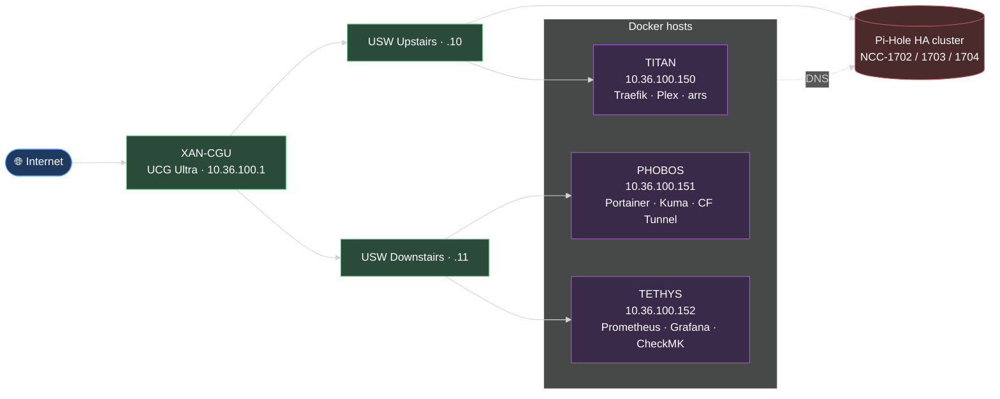
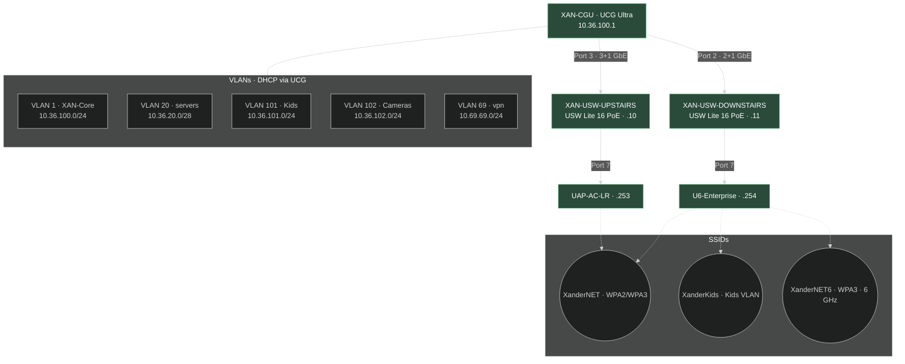
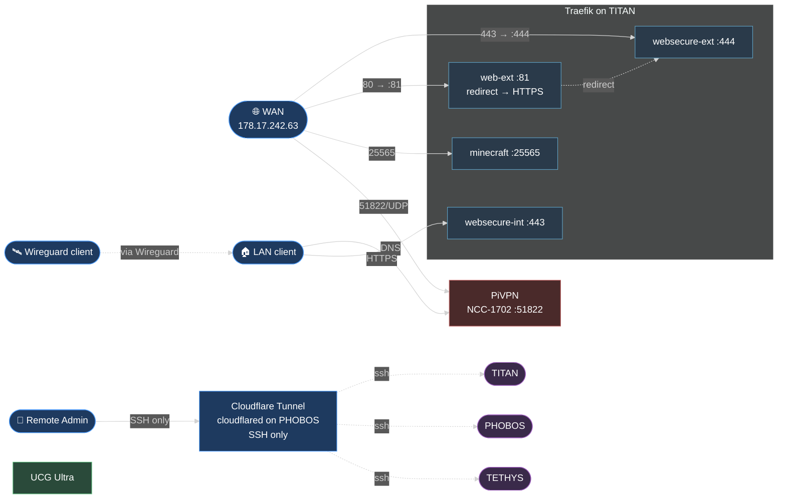
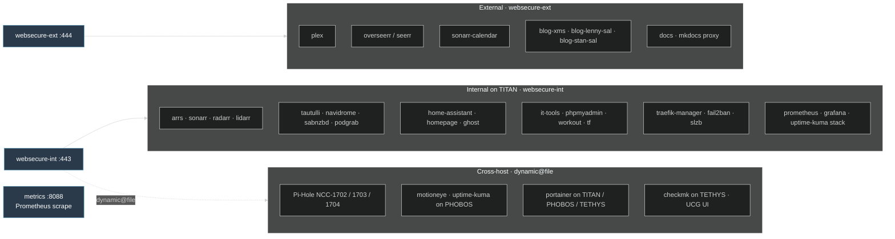
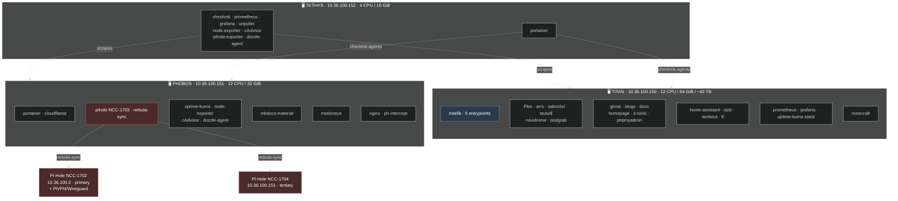

# Homelab Infrastructure

This page documents the overall infrastructure of the homelab. The single mega-diagram has been split into focused views — each section below drills into one concern.

## 1. High-level overview

The data path from the internet through to the three Docker hosts.

## 2. Network, VLANs & Wi-Fi

UCG Ultra → Unifi switches → APs, plus the VLAN and SSID layout.

### Port forwards on the UCG

| WAN port | Destination | Purpose |
|---|---|---|
| 80 | 10.36.100.150:81 | Traefik web-ext (HTTP → HTTPS redirect) |
| 443 | 10.36.100.150:444 | Traefik websecure-ext |
| 25565 | 10.36.100.150:25565 | Minecraft |
| 51822 | 10.36.100.2:51822 | PiVPN / Wireguard |

## 3. External access & ingress

How traffic gets in: WAN port forwards, Cloudflare Zero Trust tunnel for SSH, and Wireguard for remote LAN access.

## 4. Traefik routing

Entry points and the services they front. Cross-host routes go via dynamic@file on websecure-int.

## 5. Hosts & containers

What runs where. Service groups are collapsed by purpose to keep things readable.

