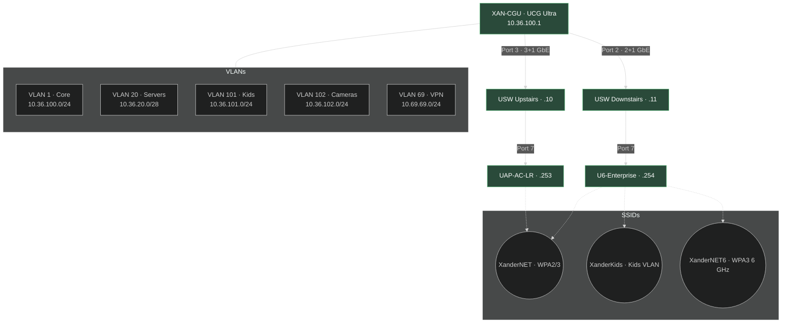
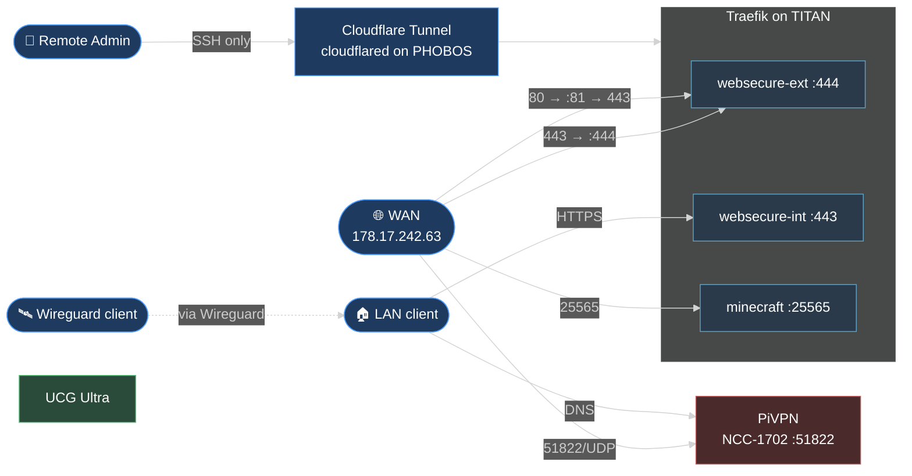
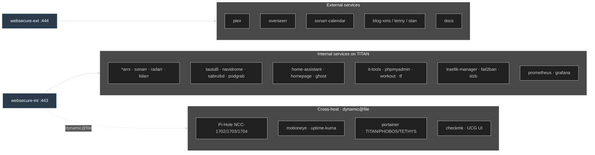
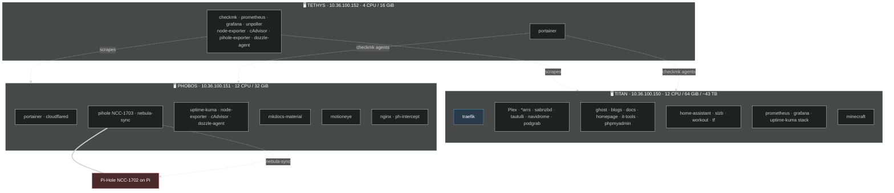

# Homelab Infrastructure

This diagram shows the overall infrastructure of the homelab.

```mermaid
# Homelab Infrastructure

High-level overview of the homelab — network edge, three Docker hosts, and the Traefik-fronted services. Each section below drills into one area.

## 1. High-level overview

```mermaid
%%{init: {'theme':'dark','flowchart':{'nodeSpacing':55,'rankSpacing':80,'curve':'basis','htmlLabels':true}}}%%
flowchart LR
    Internet([🌐 Internet]):::edge
    CGU[XAN-CGU<br/>UCG Ultra · 10.36.100.1]:::net
    SWU[USW Upstairs<br/>.10]:::net
    SWD[USW Downstairs<br/>.11]:::net

    subgraph HOSTS[Docker hosts]
        direction TB
        TITAN[TITAN<br/>10.36.100.150<br/>Traefik · Plex · *arrs]:::host
        PHOBOS[PHOBOS<br/>10.36.100.151<br/>Portainer · Kuma · CF Tunnel]:::host
        TETHYS[TETHYS<br/>10.36.100.152<br/>Prometheus · Grafana · CheckMK]:::host
    end

    DNS[(Pi-Hole HA cluster<br/>NCC-1702/1703/1704)]:::dns

    Internet --> CGU
    CGU --> SWU --> TITAN
    CGU --> SWD --> PHOBOS
    SWD --> TETHYS
    SWU --> DNS
    HOSTS -. "DNS" .-> DNS

    classDef edge fill:#1e3a5f,stroke:#4f9eff,color:#fff
    classDef net  fill:#2a4a3a,stroke:#5fbf7f,color:#fff
    classDef host fill:#3a2a4a,stroke:#a060c0,color:#fff
    classDef dns  fill:#4a2a2a,stroke:#c06060,color:#fff
```

## 2. Network, VLANs & Wi-Fi



## 3. External access & ingress



## 4. Traefik routing



## 5. Hosts & containers


```
