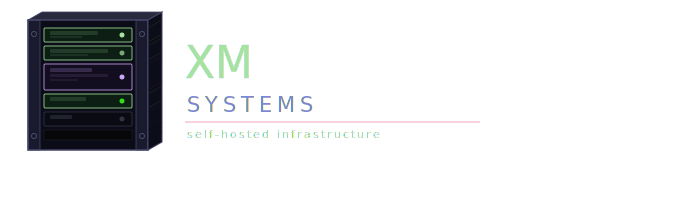

# Welcome to...

This site will provide you with all the nerdy details of my homelab.

My name is Alex and I work in Infrastructure as an AWS Cloud Engineer and prior to this as an IT Professional for a well known telecommunications company in the UK.

Working in this industry and being a follower of all things computing has enabled me to build computers of all shapes & sizes as well as self-host multiple services popular with many homelabbers.

This site documents various aspects of my homelab and details:

    - Devices
    - Networking
    - Docker Install/Setup
    - Reverse Proxy/Load Balancing
    - Applications/Services/Containers

I have also created a [blog site](https://blog.xmsystems.co.uk) where I will try and post about things I get upto on a regular basis.  Please check this out and subscribe.

***Thank You!***  