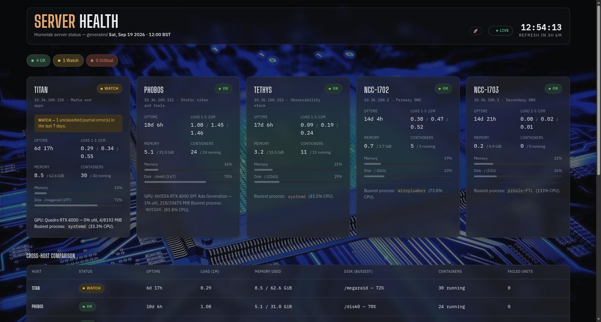

# Server Health

`health.xmsystems.co.uk` — fleet-wide server health board covering all five hosts (Titan, Phobos, Tethys, NCC-1702, NCC-1703), refreshed every 4 hours.



Like the other internal dashboards, the page sits over a full-page
circuit-board background image with a `🚀 BACKGROUND` toggle in the header
(persisted via `localStorage`) to strip it back to plain opaque cards. The
masthead, host cards, and cross-host comparison table are all translucent
"scrim" glass panels over the image, matching the treatment on Storage
Monitor, Update Status, and Pi-hole Status.

## What it shows

A summary legend at the top (**OK** / **Watch** / **Critical** counts, always shown even at zero — it doubles as a colour key for the cards below), then one card per host:

- Uptime and load average (1·5·15 min)
- Memory used / total
- Containers running / total
- Disk usage on the busiest local mount, as a meter
- GPU status (Titan and Phobos only — the other three hosts have no NVIDIA card, so the line is omitted entirely rather than showing "no GPU")
- Busiest process by CPU
- Failed systemd unit count
- A coloured **reason callout** on any Watch/Critical card, naming exactly what tripped it (disk threshold, load, journal errors, or the specific failed unit names)

Below the cards, a **Cross-host comparison** table gives the same core figures side by side for a quick scan.

## Status thresholds

| Status | Trigger |
| --- | --- |
| **OK** | None of the below |
| **Watch** | 1-minute load average > 75% of that host's core count, **or** busiest local disk mount ≥ 75% full, **or** unclassified journal errors in the last 7 days |
| **Critical** | Any systemd unit in a failed state, **or** the host couldn't be reached over SSH |

"Unclassified" journal errors excludes routine noise (sudo/pam auth prompts from interactive sessions, `pam_wtmpdb` logout races) — only genuine `journalctl -p err` entries count.

## How it works

```text
Cron (Phobos, every 4h)
  └─▶ generate-serverstatus.sh
        ├─▶ ssh titan      (uptime, load, free, df, docker ps, systemctl --failed, journalctl)
        ├─▶ (local)        phobos — same checks, run directly, no ssh hop
        ├─▶ ssh tethys     — ″ —
        ├─▶ ssh ncc-1702   — ″ —
        └─▶ ssh ncc-1703   — ″ —
              └─▶ writes serverstatus.html straight into nginx's docroot on Phobos
                    └─▶ nginx (Phobos, Docker) serves it
                          └─▶ Traefik (Titan, `websecure-int`) → health.xmsystems.co.uk
```

Unlike the [Storage Monitor](storage.md) or the [Unattended Upgrades dashboard](unattended-upgrades.md#live-status-dashboard), this page has **no backend API and no client-side JS polling** — it's a static HTML snapshot, regenerated on a schedule and served as-is. Reloading the page shows exactly what the last cron run produced; there's nothing "live" about it between runs.

- Source: `generate-serverstatus.sh` in the `healthchecks` repo (`/home/xander/scripts/healthchecks` on Phobos), alongside five standalone `server-healthcheck-<host>` scripts for ad-hoc manual checks (`uname`, `docker ps -a`, listening ports, last logins, last 50 journal errors, etc. — a full narrative dump for reading in a terminal, not the structured data this page needs).
- Cron: `0 */4 * * * /home/xander/scripts/healthchecks/generate-serverstatus.sh >> /home/xander/scripts/healthchecks/serverstatus.log 2>&1`
- A host that can't be reached over SSH renders as an "Unreachable" Critical card rather than breaking the rest of the page.

!!! note "Running it on demand"
    ```bash
    ssh phobos /home/xander/scripts/healthchecks/generate-serverstatus.sh
    ```
    Useful straight after fixing something you don't want to wait up to 4 hours to see reflected.

!!! note "Editing the page's HTML/CSS"
    `serverstatus.html` is regenerated from scratch every 4 hours, so any
    manual edit to the file on Phobos gets silently overwritten at the next
    cron run. Styling, markup, and layout changes (background image, the
    `🚀 BACKGROUND` toggle, card treatment, etc.) belong in the heredoc
    template inside `generate-serverstatus.sh` itself — edit the script, then
    run it once on demand (above) to deploy immediately instead of waiting
    for the next scheduled run.

## Troubleshooting

- **A host shows "Unreachable"** — check its SSH service and that Phobos's `~/.ssh/config` entry / key for that host is still valid. The other four hosts' cards are unaffected.
- **Page looks stale** — check `crontab -l` on Phobos for the `generate-serverstatus.sh` line, and tail `/home/xander/scripts/healthchecks/serverstatus.log` for the last run's output/errors.
- **A host is stuck on "Watch" after fixing the underlying issue** — the journal-error trigger looks at the last 7 days, so a fixed problem keeps flagging until the old log entries age out of that window; it won't get worse, just takes up to a week to clear on its own.

## Related

- [Storage Monitoring](storage.md) — live RAID/disk dashboard, same visual theme, updates every 30s via its own backend API
- [Unattended Upgrades](unattended-upgrades.md) — the `updates.xmsystems.co.uk` dashboard, same theme, checks once daily
- [Pi-hole Status](piholes.md) — same static-snapshot pattern, 1-minute cadence across the DNS fleet
- [Automatic Container Updates](container-updates.md) — same visual theme, weekly per-host update dashboard
