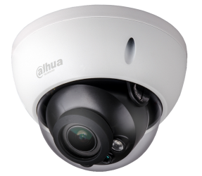

Motioneye is a video surveillance program that offers motion detection.

I have this setup so that if motion is detected, recording occurs which is then stored for upto a month.

## docker-compose file location
```sh
── ~/
│  └─ docker-compose/
│     ├── motioneye
│     │   └── docker-compose.yml
```

## Appdata

```sh
── ~/
│  └─ appdata/
│     └─ sonarr/
|     └─ radarr/
|     └─ lidarr/
|     └─ readarr/
```

## docker-compose.yml

``` yaml
networks:
  default:
    name: phobos-network
    external: true

services:
  motioneye:
    privileged: True
    image: ccrisan/motioneye:master-amd64
    container_name: motioneye
    hostname: XAN-CAMERAS
    networks:
      default:
        ipv4_address: "172.20.0.7"
    restart: unless-stopped
    ports:
      - "8765:8765"
      - "8081:8081"
      - "8082:8082"
    volumes:
      - /etc/localtime:/etc/localtime:ro
      - /home/xander/appdata/motioneye/shared:/shared
      - /home/xander/appdata/motioneye/etc:/etc/motioneye
      - /disk1/cctv/recordings/xan-cam/:/recordings
```

###Dynamic File

As this is hosted on a different host to where Traefik is running, a dynamic file is required for it to be routed through Traefik and with SSL.

This file is located [here](https://docs.xmsystems.co.uk/dynamic/#motioneye-cuthbert)

##Cameras



Connected to MotionEye currently is a Dahua camera which overlooks the front of my house and my cars.

I also have a Reolink wifi camera which is being used internally as kind of a pet and toddler camera.

##Future Plans

I do like Motioneye and have been using it for quite some time.  
My future plans unfortunately don't include Motioneye.  I will be getting more cameras (mainly external) and I plan on using BlueIris. 

I have also been looking into Frigate with the use of a Coral TPU for object detection.
