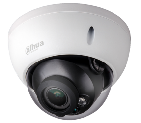

# MotionEye


Motioneye is a video surveillance program that offers motion detection.

I have this setup in constant record where data is recorded and stored for upto a month

## Migration to motioneye-project fork

The original `ccrisan/motioneye` image had been unmaintained since 2020. In August 2026 I migrated to the actively maintained community fork, [motioneye-project/motioneye](https://github.com/motioneye-project/motioneye), which picked development back up and has since shipped fixes including CVE-2026-46488.

At the same time I:

- Dropped `privileged: true` from the container — both cameras connect over RTSP, not as local devices, so it was never actually needed.
- Moved `/var/lib/motioneye` from an anonymous Docker volume to an explicit bind mount, so all container state lives under `/ssd/docker/appdata/motioneye/`.

The existing camera and motion-detection config carried over cleanly with no changes needed. The only casualty was a stale browser/app session on a phone that had the old live-view page open — the new version's auth scheme is HMAC-based rather than the old signed-username scheme, so any old session just needs a fresh login.

## docker-compose.yml

``` yaml
networks:
  phobos-network:
    external: true

services:
  motioneye:
    image: ghcr.io/motioneye-project/motioneye:0.44.0
    container_name: motioneye
    hostname: XMS-Cameras
    networks:
      phobos-network:
        ipv4_address: "172.20.0.15"
    restart: unless-stopped
    ports:
      - "8765:8765"
      - "8081:8081"
      - "8082:8082"
    environment:
      TZ: Europe/London
      NVIDIA_VISIBLE_DEVICES: all
      NVIDIA_DRIVER_CAPABILITIES: compute,video,utility
    deploy:
      resources:
        reservations:
          devices:
            - driver: nvidia
              count: 1
              capabilities: [gpu]
    volumes:
      - /etc/localtime:/etc/localtime:ro
      - /ssd/docker/appdata/motioneye/shared:/shared
      - /ssd/docker/appdata/motioneye/etc:/etc/motioneye
      - /ssd/docker/appdata/motioneye/var-lib:/var/lib/motioneye
      - /disk1/cctv/recordings/xan-cam/:/recordings
      - /ssd/docker/appdata/motioneye/patches/base.py:/usr/local/lib/python3.13/dist-packages/motioneye/handlers/base.py:ro
      - /ssd/docker/appdata/motioneye/patches/motion:/usr/bin/motion:ro
      - /ssd/docker/appdata/motioneye/patches/main.html:/usr/local/lib/python3.13/dist-packages/motioneye/templates/main.html:ro
```

The last three volume lines are the patches described below — each bind-mounts a modified file from `/ssd/docker/appdata/motioneye/patches/` over its stock counterpart inside the image, read-only. None of them touch the image itself, so a plain `docker compose up -d` re-applies all three on every recreate, and dropping any single line reverts just that one piece of behaviour back to stock.

### Authentication disabled

The web UI's login is fully disabled — anyone who can reach `:8765` (LAN/VPN only, nothing is exposed to the internet) gets straight in with full admin rights, no credentials at all.

This fork's `handlers/login.py` doesn't actually support a true "blank password = anonymous viewer" mode: setting a blank `@normal_password` in `motion.conf` just makes the login endpoint respond with `force_password_change: true`, and the frontend immediately force-logs the session back out with a "set a password" prompt. So instead of touching the password config at all, `handlers/base.py`'s `BaseHandler.get_current_user()` — the one function every request's auth check ultimately calls — was patched to unconditionally `return 'admin'`. No cookie, no session, no login dialog ever fires; every request is just treated as an authenticated admin from the start.

### Dynamic File

As this is hosted on a different host to where Traefik is running, a dynamic file is required for it to be routed through Traefik and with SSL.

- [motioneye dynamic file configuration](https://docs.xmsystems.co.uk/dynamic/#motioneye-phobos)

### Cameras



Connected to MotionEye currently is a Dahua camera which overlooks the front of my house and my cars.

I also have a Reolink wifi camera which is being used internally as kind of a pet and toddler camera.

### GPU-accelerated encoding (NVENC/NVDEC)

Phobos has an [NVIDIA RTX 4000 SFF Ada](phobos.md) sitting mostly idle. Since the front-of-house camera (`house-front`, a Dahua) records continuously in 1080p25, the `motion` daemon inside the container was constantly pegging the CPU at 120-150% doing everything — capturing, decoding, and software-encoding — on the CPU. Motion detection itself is switched off for this camera (it's continuous-record, not event-triggered), so all of that CPU time was going into moving and encoding video, not analysing it — exactly the kind of work a GPU is good at.

**The straightforward half worked immediately.** Adding `netcam_params decoder=h264_cuvid` to the camera's config tells `motion` to decode the incoming RTSP stream via NVDEC instead of the CPU — this is a real, documented `motion.conf` option (the decoder name comes straight from `ffmpeg -decoders`), no code changes needed. Confirmed working via `nvidia-smi --query-compute-apps` showing the `motion` process as an active GPU consumer.

**The hard half needed a source patch.** The obvious next step — setting `movie_codec mkv:h264_nvenc` so movie *encoding* also runs on the GPU — broke recording outright. Motion 4.7.1 (the version this image ships) has a real bug: `ffmpeg_set_quality()` in `src/ffmpeg.c` unconditionally applies three libx264-only encoder options (`tune=zerolatency`, `crf=<n>`, `preset=superfast`) to every H.264/HEVC encoder except its two hardcoded Raspberry-Pi-specific cases (`h264_omx`, `h264_v4l2m2m`). NVENC's encoder doesn't recognise `tune=zerolatency` as a valid value, so `avcodec_open2()` fails outright and the camera stops recording. Reproducible in isolation with nothing but a standalone `ffmpeg -c:v h264_nvenc -tune zerolatency ...` command — same failure, so it's not a motionEye-specific quirk, it's upstream Motion.

There's no config-level way around this — `movie_codec` doesn't accept arbitrary extra ffmpeg options, so the fix meant patching Motion's actual C source:

- Cloned [`Motion-Project/motion`](https://github.com/Motion-Project/motion) at tag `release-4.7.1` (the tag this image's binary was built from — the `master` branch has since been rewritten to C++, so it doesn't apply here).
- Added a `USER_CODEC_NVENC` case to `enum USER_CODEC` in `src/ffmpeg.h`.
- In `ffmpeg_set_codec_preferred()`, detect `h264_nvenc`/`hevc_nvenc` by name and tag them with the new enum value.
- In `ffmpeg_set_quality()`, skip the `tune`/`preset` options for that case, and route NVENC through the same bitrate-only quality path already used for the OMX/v4l2m2m hardware encoders (setting `bit_rate`/`profile` directly on the generic `AVCodecContext` struct instead of via encoder-specific option strings — every encoder honours those fields, so there's nothing left to reject).

The patched binary was built inside a disposable container based on the exact same image (`ghcr.io/motioneye-project/motioneye:0.44.0`) with the standard Motion build dependencies installed, so it links against compatible shared libraries. It was validated end-to-end — against the real camera feed, producing a genuine playable file — inside a fully isolated test container before it ever touched the production one. The compiled binary now lives at `/ssd/docker/appdata/motioneye/patches/motion` and gets bind-mounted over `/usr/bin/motion` (see the compose file above); the actual source diff is kept alongside it at `/ssd/docker/appdata/motioneye/patches/nvenc-motion.patch` so a future rebuild — say, after a base image update — doesn't mean re-deriving the fix from scratch.

**Result:** with both NVDEC decode and NVENC encode offloaded, the container's average CPU usage dropped from ~150% to roughly **75-95%** — measured repeatedly with `docker stats`, not a one-off sample. Digging into what's left with a per-thread breakdown of the `motion` process shows the remaining cost isn't hiding a third GPU opportunity: it's the core per-camera loop drawing the burned-in timestamp overlay onto every frame and feeding the encoder, which is plain CPU-bound pixel work with no GPU path in Motion at all. Further reduction from here would mean dropping the timestamp overlay or the resolution/framerate, not more offloading.

One side effect worth knowing about: Motion's bitrate-only quality path (the same one the OMX/v4l2m2m hardware encoders already used) produces a flat, formula-based bitrate rather than adaptive CRF — at the existing `movie_quality 75` setting, that works out to roughly 18Mbps continuous, noticeably higher than the old software encoder's scene-adaptive output. Kept deliberately, since the extra ~190GB/day comfortably fits inside phobos's available storage for the 7-day retention window.

The motionEye UI's own "Movie Format" dropdown (`templates/main.html`) only ever pairs its NVENC preset with an `.mp4` container, never `.mkv` — since this camera's config uses `mkv:h264_nvenc` (kept `.mkv` rather than switching containers), the dropdown couldn't match it to any option and silently fell back to showing "MPEG4 (.avi)", even though the actual recorded files were always genuine `.mkv`/`h264`. Fixed by patching the template to add proper `mkv:h264_nvenc`/`mkv:hevc_nvenc` options (bind-mounted the same way as the `motion` binary) — purely cosmetic, never affected what was actually being recorded.

### Future Plans

I do like Motioneye and have been using it for quite some time.  
My future plans unfortunately don't include Motioneye.  I will be getting more cameras (mainly external) and I plan on using BlueIris.

I have also been looking into Frigate with the use of a Coral TPU for object detection.
