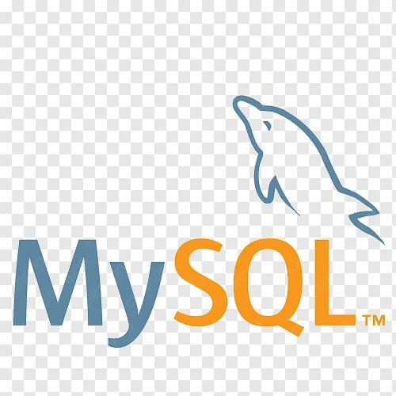

# MySQL Database



MySQL is used as the database of choice for a number of containers.

- Ghost
- Guacamole
- Firefly III

## docker-compose.yml

```yaml
networks:
  default:
    name: proxy
    external: true

services:
  titan-mysql-db:
    image: mysql:8.0
    container_name: titan-mysql-db
    restart: unless-stopped
    environment:
      MYSQL_ROOT_PASSWORD: ${MYSQL_ROOT_PASSWORD}
    volumes:
      - /ssd/docker/appdata/titan-mysql-db:/var/lib/mysql
    networks:
      default:
        ipv4_address: "172.19.0.200"
```
