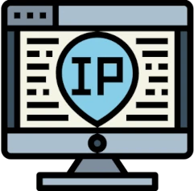

# Nginx Web Server


nginx runs as a Docker container on Phobos on port 88, acting as the primary web server for several internal applications. It handles static file serving, Basic Auth, and WebSocket proxying. Where a service needs to be reachable from outside the LAN, Traefik routes to nginx on port 88.

## Hosted Services

| Service | URL | Description |
| ------- | --- | ----------- |
| Infrastructure Overview | [infrastructure.xmsystems.co.uk](https://infrastructure.xmsystems.co.uk) | Interactive network and infrastructure diagram — embedded on the [Overview](overview.md) page |
| IPAM | [ipam.xmsystems.co.uk](https://ipam.xmsystems.co.uk) | Custom-built IP Address Management tool |
| XMS Games Hub | [games.xmsystems.co.uk](https://games.xmsystems.co.uk) | Party game platform — see [Games](games/games-overview.md) |
| Poker Clock | [poker.xmsystems.co.uk](https://poker.xmsystems.co.uk) | Tournament dashboard with real-time multi-device sync — see [Poker Clock](games/poker.md) |
| Workout Timer | `workout.[internal]` | Timer and workout reference page |

---

## Docker Setup

nginx and the Poker WebSocket backend are managed together in a single compose file.

**File:** `/ssd/docker/docker-compose/nginx/docker-compose.yml`

```yaml
networks:
  phobos-network:
    external: true

services:
  nginx:
    image: nginx
    networks:
      phobos-network:
        ipv4_address: '172.20.0.20'
    ports:
      - 88:80
    volumes:
      - /ssd/docker/appdata/nginx/:/usr/share/nginx/html:ro
      - /ssd/docker/appdata/nginx/default.conf:/etc/nginx/conf.d/default.conf
      - /ssd/docker/appdata/nginx/.htpasswd:/etc/nginx/.htpasswd
    container_name: nginx
    restart: unless-stopped
    environment:
      - TZ=Europe/London
    depends_on:
      - poker-server

  poker-server:
    build: /ssd/docker/appdata/poker
    container_name: poker-server
    restart: unless-stopped
    networks:
      phobos-network:
        ipv4_address: '172.20.0.21'
    environment:
      - TZ=Europe/London
```

| Container | Image | IP |
| --------- | ----- | -- |
| `nginx` | `nginx` (official) | `172.20.0.20` |
| `poker-server` | Local Dockerfile | `172.20.0.21` |
| `ipam-backend` | Local Dockerfile | `172.20.0.201` (separate compose) |

### Updating

From `/ssd/docker/docker-compose/nginx/`:

```bash
docker compose pull; docker compose build; docker compose up -d --force-recreate
```

- `pull` — updates the nginx image
- `build` — rebuilds the poker-server from the local Dockerfile
- `--force-recreate` — restarts both containers

---

## nginx Configuration

All server blocks live in `/ssd/docker/appdata/nginx/default.conf`. The nginx container bind-mounts `/ssd/docker/appdata/nginx/` to `/usr/share/nginx/html` inside the container, so static file changes take effect immediately without a reload.

### Infrastructure Overview

Serves the static infrastructure diagram page that is embedded as an iframe in the [Overview](overview.md) documentation page.

```nginx
server {
    listen 80;
    server_name infrastructure.xmsystems.co.uk;

    location / {
        root /usr/share/nginx/html;
        index infrastructure.html;
        try_files $uri $uri/ =404;
    }
}
```

**File:** `/ssd/docker/appdata/nginx/infrastructure.html`

---

### IPAM

Routes `/` to the static IPAM frontend and `/api/` to the `ipam-backend` container at `172.20.0.201:3001`.

```nginx
server {
    listen 80;
    server_name ipam.xmsystems.co.uk;

    location / {
        root /usr/share/nginx/html/ipam;
        index index.html;
        try_files $uri $uri/ /index.html;
    }

    location /api/ {
        proxy_pass http://172.20.0.201:3001/api/;
        proxy_set_header Host $host;
        proxy_set_header X-Real-IP $remote_addr;
        proxy_connect_timeout 5s;
        proxy_read_timeout 30s;
    }

    error_page 500 502 503 504 /50x.html;
    location = /50x.html {
        root /usr/share/nginx/html;
    }
}
```

**Frontend file:** `/ssd/docker/appdata/nginx/ipam/index.html`

---

### Poker Clock

Serves the tournament dashboard and proxies WebSocket connections to the `poker-server` container. Basic Auth covers both locations at the server block level.

```nginx
server {
    listen 80;
    server_name poker.[REDACTED];

    auth_basic "Kelly's Card Club";
    auth_basic_user_file /etc/nginx/.htpasswd;

    location / {
        root  /usr/share/nginx/html;
        index poker_dashboard.html;
        try_files $uri $uri/ =404;
    }

    location /ws {
        proxy_pass http://poker-server:3003;
        proxy_http_version 1.1;
        proxy_set_header Upgrade $http_upgrade;
        proxy_set_header Connection "upgrade";
        proxy_set_header Host $host;
        proxy_read_timeout 3600s;
        proxy_send_timeout 3600s;
    }
}
```

**Dashboard file:** `/ssd/docker/appdata/nginx/poker_dashboard.html`  
**htpasswd file:** `/ssd/docker/appdata/nginx/.htpasswd`

To add or update credentials (requires `apache2-utils` installed on Phobos):

```bash
# Create or overwrite a user
htpasswd /ssd/docker/appdata/nginx/.htpasswd username
```

---

### Workout Timer

Serves the static workout page.

```nginx
server {
    listen 80;
    server_name workout.[internal];

    location / {
        root /usr/share/nginx/html/workout;
        index index.html;
        try_files $uri $uri/ /index.html;
    }
}
```

**File:** `/ssd/docker/appdata/nginx/workout/index.html`

---

## Infrastructure Diagram

The infrastructure diagram is a self-contained static HTML page served directly by nginx. It is embedded as a full-width iframe on the [Overview](overview.md) documentation page and is available full-screen at [infrastructure.xmsystems.co.uk](https://infrastructure.xmsystems.co.uk).

---

## IPAM Tool



A self-hosted IP Address Management tool for tracking networks, hosts, containers, and DNS records across the entire infrastructure. Built as a custom solution: a Node.js REST API backend, a static HTML/JS frontend, and a dedicated database on the shared `phobos-mysql-db` instance.

**URL:** [ipam.xmsystems.co.uk](https://ipam.xmsystems.co.uk)

### Architecture

```sh
Traefik (Titan)
    └── ipam.xmsystems.co.uk
            └── nginx (Phobos :88)
                    ├── /ipam/    → static frontend (bind mount)
                    └── /api/     → proxy → ipam-backend (172.20.0.201:3001)

ipam-backend  → 172.20.0.201:3001
ipam-mysql    → phobos-mysql-db (172.20.0.200)
```

### Traefik Dynamic File

```yaml
http:
  routers:
    ipam:
      entryPoints:
        - websecure-int
      rule: "Host(`ipam.xmsystems.co.uk`)"
      tls:
        certResolver: production
      service: ipam

  services:
    ipam:
      loadBalancer:
        servers:
          - url: "http://10.36.100.151:88"
        passHostHeader: true
```

### Backend

Sensitive values are stored in a `.env` file alongside the compose file.

**File:** `/ssd/docker/docker-compose/ipam-backend/docker-compose.yml`

```yaml
networks:
  phobos-network:
    external: true

services:
  ipam-backend:
    build: .
    container_name: ipam-backend
    restart: unless-stopped
    environment:
      DB_HOST: phobos-mysql-db
      DB_PORT: 3306
      DB_USER: ipam
      DB_PASSWORD: ${MYSQL_PASSWORD}
      DB_NAME: ipam
    networks:
      phobos-network:
        ipv4_address: 172.20.0.201
```

`.env`:

```sh
MYSQL_PASSWORD=yourpassword
```

After any changes to `server.js`:

```bash
cd /ssd/docker/docker-compose/ipam-backend
docker compose build
docker compose up -d --force-recreate
```

### MySQL Database

IPAM uses the shared `phobos-mysql-db` MySQL instance. The database and user are created manually.

```bash
# Create the database
docker exec -it phobos-mysql-db mysql -uroot -p -e "CREATE DATABASE ipam;"

# Create the user and grant access
docker exec -it phobos-mysql-db mysql -uroot -p -e "
  CREATE USER 'ipam'@'%' IDENTIFIED BY 'yourpassword';
  GRANT ALL PRIVILEGES ON ipam.* TO 'ipam'@'%';
  FLUSH PRIVILEGES;
"
```

Load the schema:

```bash
docker exec -i phobos-mysql-db mysql -uipam -p'yourpassword' ipam < /ssd/docker/appdata/mysql/init-scripts/ipam-schema.sql
```

!!! note
    The schema file lives at `/ssd/docker/appdata/mysql/init-scripts/ipam-schema.sql` alongside other database init scripts.

For subsequent schema changes (the init SQL only runs on a fresh data directory):

```bash
docker exec -it phobos-mysql-db mysql -uipam -p'yourpassword' ipam
```

Example — adding a column:

```sql
ALTER TABLE networks ADD COLUMN dhcp_start VARCHAR(45) NULL, ADD COLUMN dhcp_end VARCHAR(45) NULL;
```

### Data Import Scripts

Python scripts live on Phobos at `/ssd/docker/appdata/ipam/scripts/`. All scrapers are upsert-safe — they add new records and update existing ones and are safe to run at any time.

#### Docker scraper

Connects to Phobos (local socket), Titan, Tethys and NCC-1702 (TLS) and imports all Docker networks and container IPs. Marks containers no longer running as offline. Uses TLS certs from `/etc/docker/certs/` for remote hosts.

```bash
python3 docker-ipam-scraper.py
```

#### UniFi scraper

Pulls all networks, DHCP clients and DHCP ranges from the UniFi gateway at `10.36.100.1`. Updates hostname, MAC and online/offline status on existing hosts. Only creates a network if at least one host is present.

```bash
python3 unifi-ipam-scraper.py
```

#### Pi-hole scraper

Pulls local DNS records from Pi-hole v6 on NCC-1702 via the API at `http://10.36.100.2/api/config/dns/hosts`. Updates records where the IP has changed and removes records no longer in Pi-hole.

```bash
python3 pihole-ipam-scraper.py
```

#### PiVPN / WireGuard scraper

SSHes to NCC-1702 using the `ncc-1702` SSH config entry and reads WireGuard peer config from `/etc/wireguard/wg0.conf`. Prompts for SSH key passphrase if required. Run manually only.

```bash
python3 pivpn-ipam-scraper.py
```

Imports the WireGuard network, gateway host, and all peers with their VPN IPs and names. Checks live handshake status via `wg show` to set online/offline.

### Automated Refresh

The Docker, UniFi and Pi-hole scrapers run every 6 hours via cron on Phobos. The WireGuard scraper is excluded as peers rarely change and it requires an interactive SSH passphrase.

```sh
0 */6 * * * /ssd/docker/appdata/ipam/scripts/ipam-refresh.sh
```

`ipam-refresh.sh` runs all three scrapers in sequence and writes output to a daily log file. Logs are stored at `/ssd/docker/appdata/ipam/logs/` and automatically cleaned up after 7 days.

### IPAM Features

- **Networks** — Physical, VLAN, Docker, WireGuard with parent/child relationships
- **Hosts** — IP, MAC, hostname, status, role flags (gateway, DHCP, DNS), Docker container details
- **IP map** — Visual grid per network: free (green), taken (red), DHCP range (orange), reserved (purple)
- **DNS records** — A, AAAA, CNAME, PTR, MX, TXT linked to hosts
- **Global search** — Search across IP, hostname, MAC, container name
- **Audit log** — All creates and updates recorded
- **Utilisation** — Per-network address usage with free range listing

---

## Poker Clock Dashboard


A self-hosted poker tournament dashboard with real-time multi-device sync via WebSockets. Protected by nginx Basic Auth.

| Component | Technology |
| --------- | ---------- |
| Frontend | Single-file HTML/CSS/JavaScript — no frameworks |
| Backend | Node.js WebSocket server (`ws` library) — holds tournament state in memory |
| Web server | nginx (Docker container on Phobos) |
| Auth | nginx Basic Auth — credentials stored in `.htpasswd` |

### WebSocket Backend

**Dockerfile:** `/ssd/docker/appdata/poker/Dockerfile`

```dockerfile
FROM node:20-alpine
WORKDIR /app
COPY package.json .
RUN npm install
COPY server.js .
EXPOSE 3003
CMD ["node", "server.js"]
```

**package.json:** `/ssd/docker/appdata/poker/package.json`

```json
{
  "name": "poker-state-server",
  "version": "1.0.0",
  "description": "WebSocket state server for Kelly's Card Club",
  "main": "server.js",
  "scripts": {
    "start": "node server.js"
  },
  "dependencies": {
    "ws": "^8.18.0"
  }
}
```

### File Locations

| File | Path on Phobos |
| ---- | -------------- |
| Dashboard HTML | `/ssd/docker/appdata/nginx/poker_dashboard.html` |
| nginx config | `/ssd/docker/appdata/nginx/default.conf` |
| htpasswd file | `/ssd/docker/appdata/nginx/.htpasswd` |
| Node.js server | `/ssd/docker/appdata/poker/server.js` |
| Dockerfile | `/ssd/docker/appdata/poker/Dockerfile` |

### Poker Clock Features

- Blind schedule with 8 levels (1/2 through 50/100)
- Configurable players, buy-in amount, and level duration
- Countdown timer with auto-start on level change
- Audible alerts — 1 minute warning beep, countdown clicks for last 5 seconds
- 20 minute break auto-triggered after configurable play time, with manual override
- Break end requires manual start
- Rebuy tracking — increases prize pool, locked after break
- Elimination tracking per player
- Prize pool auto-calculated and split 50/30/20 rounded to nearest £5
- Real-time sync across all connected devices via WebSocket
- Tournament setup panel collapses after applying

### Traefik Routing

The Poker Clock is externally accessible via Traefik, with nginx Basic Auth providing the authentication layer.

```yaml
http:
  routers:
    poker:
      entryPoints:
        - websecure-ext
      rule: "Host(`poker.[REDACTED]`)"
      tls:
        certResolver: production
      service: poker

  services:
    poker:
      loadBalancer:
        servers:
          - url: "http://10.36.100.151:88"
        passHostHeader: true
```

!!! warning
    Poker server state is **in-memory only** — a container restart resets the tournament. The `.htpasswd` file is bind-mounted from the host and survives restarts.

---

## Workout Timer App


A static single-page application serving a workout timer and exercise reference. Hosted internally via nginx on Phobos.

**File:** `/ssd/docker/appdata/nginx/workout/index.html`
