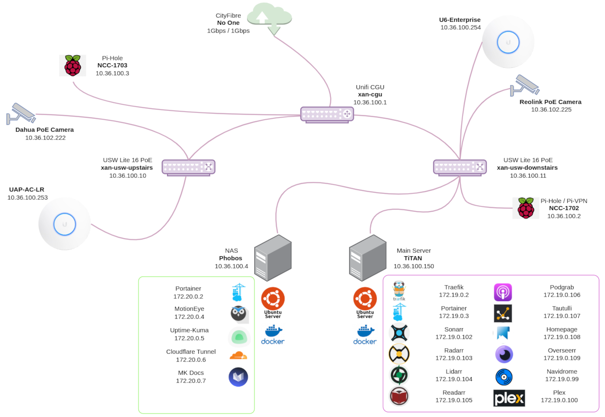

## Overview

To give you an idea of what my setup looks like, this page will explain at a high level what sort of network I have and the different pieces of hardware I'm running.

### Network Diagram

Other pages on this site will go into lots of detail of the different servers, their OS's, the applications i'm running and my networking setup.

### Internet

I have an FTTP internet connection provided by "No One" here in the UK.  This is provided over the "City Fibre" full fibre network. 
This provides me with a symmetrical gigabit connection.  
My Unifi Cloud Gateway Ultra is able to plug directly into the ONT.

### DNS & VPN

I am currently running two raspberry Pi's which act as my DNS resolvers and provide ad-blocking through a service called Pi-Hole.  They are both kept in sync with [nebula-sync](https://github.com/mattwebbio/nebula-sync).

The primary Pi runs [PiVPN](https://www.pivpn.io/) which uses the "Wireguard" protocol and allows me to connect to my internal-only facing services from outside of my network

I have 2 main servers and an assortment of PC's, mobile phones, laptops and a gaming console.

### Applications

Docker.....  
Pretty much everything I host on my 2 main servers (including this site), runs in docker.  

All written and configured using docker compose.

### Future Plans

I do have some other, more powerful, hardware waiting to be deployed and I have plans to upgrade some of my existing networking gear.

For example, the Unifi Cloud Gateway Ultra is good and certainly performs better than the USG I user to have but I would very much like to change to a UDM Pro.  I also would like to upgrade to a 2.5Gb capable ethernet switch so my Unifi 6 Enterprise Access Point can perform to its fullest.

There are house improvements and/or a house move on the horizon which will allow for my expansion plans to go into overdrive.  

I plan on blogging the whole thing as and when it happens.

