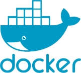

# Overview

A high-level summary of my homelab — the hardware, networking, and services that make it up.  Each section links to its own dedicated page for the full details.

<iframe src="https://infrastructure.xmsystems.co.uk" style="width:100%; height:600px; border:none; border-radius:4px;" title="Infrastructure Diagram" loading="lazy"></iframe>

[Open in full screen :octicons-link-external-16:](https://infrastructure.xmsystems.co.uk){ .md-button }

---

## Network

### Internet

Symmetrical gigabit FTTP provided by **Zen**, delivered over the **CityFibre** full fibre network.  The ONT connects directly to the WAN port of the Unifi Cloud Gateway Ultra with a PPPoE connection.

### Routing & Switching

- [**Unifi Cloud Gateway Ultra**](https://docs.xmsystems.co.uk/Unifi Cloud Gateway Ultra/) — router, firewall, and built-in network controller.  Manages the entire `10.36.100.0/24` LAN subnet and handles port-forwarding for external-facing services.
- [**Unifi USW-Lite-16-PoE**](https://docs.xmsystems.co.uk/Unifi USW-Lite-16-PoE/) — 16-port PoE switch providing connectivity to all wired devices and powering the access points.

### Wi-Fi

Two [Unifi access points](https://docs.xmsystems.co.uk/Unifi Access Points/) provide full house coverage with seamless roaming:

- **Unifi U6 Enterprise** — WiFi 6 on 2.4 GHz, 5 GHz and 6 GHz
- **Unifi AC-LR** — 2.4 GHz and 5 GHz coverage

### DNS & Ad-blocking

Three Raspberry Pis act as DNS resolvers with ad-blocking via **Pi-Hole**:

| Device | Role |
|--------|------|
| [NCC-1702](https://docs.xmsystems.co.uk/NCC-1702/) | Primary DNS |
| [NCC-1703](https://docs.xmsystems.co.uk/NCC-1703/) | Secondary DNS |
| [NCC-1704](https://docs.xmsystems.co.uk/NCC-1704/) | Tertiary DNS |

All three instances are kept in sync using [Nebula-Sync](https://docs.xmsystems.co.uk/nebula-sync/).

### VPN

The primary Pi (NCC-1702) also runs [PiVPN](https://www.pivpn.io/) using the **WireGuard** protocol, providing secure remote access to internal-only services from outside the network.

---

## Servers

### Titan

[Titan](https://docs.xmsystems.co.uk/titan/) is the primary server and home to the majority of services and media storage.

- Intel i5-12600 · 64 GB DDR4 RAM
- Nvidia Quadro RTX 4000 (hardware transcoding)
- ~32 TB usable storage via RAID6 (6 × 8 TB SAS) + 4 TB Ironwolf
- Runs [Traefik](https://docs.xmsystems.co.uk/traefik/) as the reverse proxy for the entire lab
- **OS:** Debian 13 (Trixie)

### Phobos

[Phobos](https://docs.xmsystems.co.uk/phobos/) is a NAS-focused secondary server in a Jonsbo N4 case.

- Intel i5-10400 · 32 GB DDR4 RAM
- Nvidia RTX 4000 SFF Ada Generation
- 4 × 8 TB + 1 × 4 TB WD Red drives
- Hosts services that don't need to live on Titan (Pi-Hole intercept, Uptime-Kuma, MotionEye)
- **OS:** Debian 13 (Trixie)

### Tethys

[Tethys](https://docs.xmsystems.co.uk/tethys/) is a dedicated monitoring host — a repurposed HP 280 G2 SFF desktop.

- Intel i5-6500 · 16 GB RAM
- Runs [Grafana](https://docs.xmsystems.co.uk/grafana & prometheus/), [Prometheus](https://docs.xmsystems.co.uk/grafana & prometheus/) and [CheckMK](https://docs.xmsystems.co.uk/checkmk/)
- **OS:** Debian 13 (Trixie)

---

## Applications

Every service runs in **Docker**, managed with Docker Compose.  Both Titan and Phobos have their own Docker networks with static IP addressing per container.

Services are exposed via [Traefik](https://docs.xmsystems.co.uk/traefik/) with valid SSL certificates issued by Let's Encrypt through a Cloudflare DNS challenge.  Internal and external services are separated across different entry points.

Key applications include:

| Category | Applications |
|----------|-------------|
| Media | Plex, Sonarr, Radarr, Lidarr, Readarr, SABnzbd, Navidrome, Podgrab, Tautulli, Overseerr |
| Infrastructure | Traefik, Portainer, Homepage, Dozzle, Fail2Ban |
| Monitoring | Grafana, Prometheus, CheckMK, Uptime-Kuma |
| Home | Home Assistant, MotionEye |
| Finance | Firefly III |
| Networking | Pi-Hole, Nebula-Sync, PH-Intercept, Apache Guacamole |
| Data | MySQL (Titan & Phobos), phpMyAdmin, IPAM |
| Publishing | Ghost |

---

## Future Plans

- Upgrade from the UCG Ultra to a **UDM Pro** and a Unifi enterprise PoE switch — likely timed with a house move or extension
- Deploy additional hardware that is currently waiting in the wings
- Migrate Uptime-Kuma from SQLite to MySQL on Phobos

I'll be documenting the whole thing on the [blog](https://blog.xmsystems.co.uk) as it happens.
