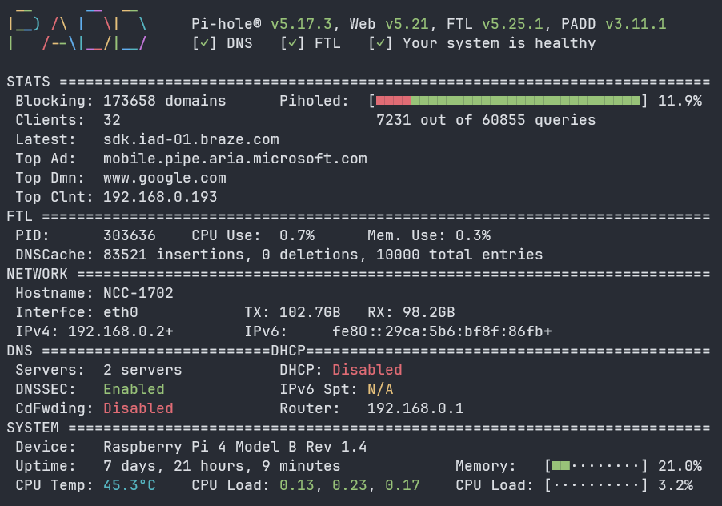

# PADD



PADD (Pi-hole® Ad Detection Display) is a terminal dashboard for Pi-hole, showing live stats — queries, blocking percentage, DNS/FTL status, network info, and system health (CPU, memory, temperature, uptime) — all from the console.

On [NCC-1702](NCC-1702.md), PADD runs full-screen on the Pi's attached 7" official Raspberry Pi touchscreen (via `tty1`), so I get an always-on physical readout of Pi-hole's status without needing to open the web UI.

## Installation

Installed using the official install script:

```bash
curl -sSL https://install.padd.sh | sh
```

This drops `padd.sh` into the user's home directory (`/home/xander/padd.sh` on NCC-1702).

## Running as a systemd service

Rather than running PADD manually in a terminal session, it's set up as a systemd service so it starts automatically on boot and re-attaches to the physical display (`tty1`):

`/etc/systemd/system/padd.service`:

```ini
[Unit]
Description=PADD Pi-hole Dashboard
After=network.target

[Service]
User=xander
WorkingDirectory=/home/xander
ExecStart=/home/xander/padd.sh
Restart=on-failure
RestartSec=5
StandardInput=tty
StandardOutput=tty
TTYPath=/dev/tty1
TTYReset=yes
TTYVHangup=yes
TTYVTDisallocate=yes

[Install]
WantedBy=multi-user.target
```

Enable and start it:

```bash
sudo systemctl daemon-reload
sudo systemctl enable --now padd
```

## Authentication (Pi-hole v6+)

Since Pi-hole v6, the web UI and API require authentication, and PADD needs to authenticate against the FTL API to pull stats — a plain unauthenticated connection is no longer enough.

Rather than storing a password in the service file, the cleanest option (and the one used here) is to add the service user to the `pihole` group. This lets PADD read `/etc/pihole/cli_pw` directly and authenticate without any credentials stored in the unit file:

```bash
sudo usermod -aG pihole xander
```

A reboot (or fresh login) is needed for the group membership to take effect.

!!! note
    If you'd rather not use group membership, PADD also accepts a `--secret` flag on `ExecStart` — but this stores the password in plaintext in the service file, so group membership is the preferred approach.
