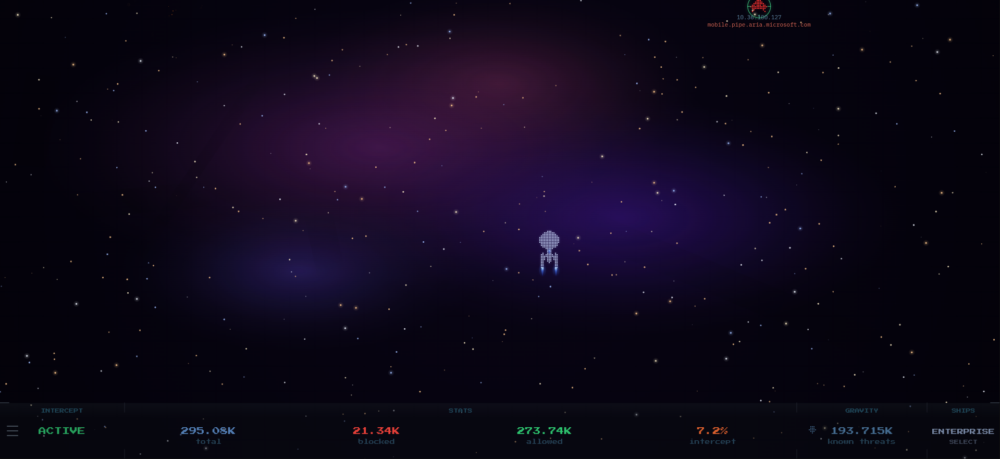

# PH-Intercept


PH-Intercept is a fun little application that I have recently come across.

Its a visualiser for pi-hole and it depicts a space battle where ads being blocked are shot at and destroyed.

[GitHub - PH-Intercept](https://github.com/m00grin/ph-intercept)



## docker-compose.yml

``` yaml
networks:
  phobos-network:
    external: true

services:
  ph-intercept:
    image: ghcr.io/m00grin/ph-intercept:latest
    hostname: ph-intercept
    container_name: ph-intercept
    restart: unless-stopped
    deploy:
      resources:
        limits:
          memory: 256m
    networks:
      phobos-network:
        ipv4_address: "172.20.0.12"
    environment:
      PIHOLE_URL: "https://subdomain.domain.co.uk/api"
      PIHOLE_PASSWORD: "${PIHOLE_PASSWORD}"
      PIHOLE_VERIFY_SSL: true
      RETURN_URL: "https://subdomain.domain.co.uk/admin"
      # Background style: starfield | dark | nebula
      BG_MODE: "nebula"
      # Sky region shown when BG_MODE=starfield:
      #   summer_triangle | orion | scorpius | southern_cross
      SKY_PRESET: "southern_cross"
      # Set BG_IMAGE to use a custom background. URL or /bg/your-filename.jpg.
      # Setting this overrides BG_MODE and shows your image instead.
      BG_IMAGE: ""
    volumes:
      - /ssd/docker/appdata/ph-intercept/bg:/app/static/bg:ro
    ports:
      - "4653:4653"
```

This of course runs via traefik so it can be accessed using SSL/HTTPS.  It has the following dynamic file

- [ph-intercept Dynamic File](https://docs.xmsystems.co.uk/dynamic/#ph-intercept-phobos)
