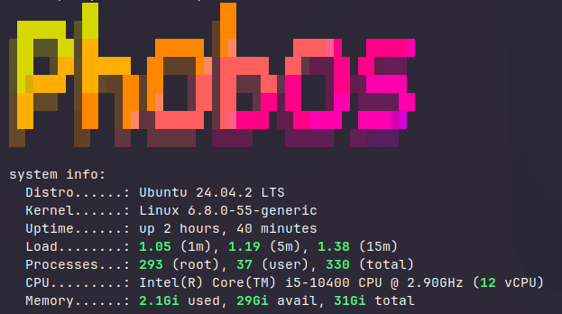

Phobos is a new build and has become a replacement for [Cuthbert](https://docs.xmsystems.co.uk/cuthbert/). It is a NAS with more power and space for more drives in a case that is not much bigger than the HP Gen8.

**Specs**

- Jonsbo N4 NAS Case
- Asus Pro q570m-c Motherboard
- Intel 10th Gen i5-10400 CPU
- 32GB DDR4 RAM (4 x 8GB)
- 1 X 1TB WD Black M.2 2280 NVMe
- 4 X 8TB WD Red drives
- 1 X 4TB WD Red drive
- 2 X 250GB Samsung 860 SSD's

**Operating System**

My operating system of choice is Debian 13
Current version - 13.3 (trixie)