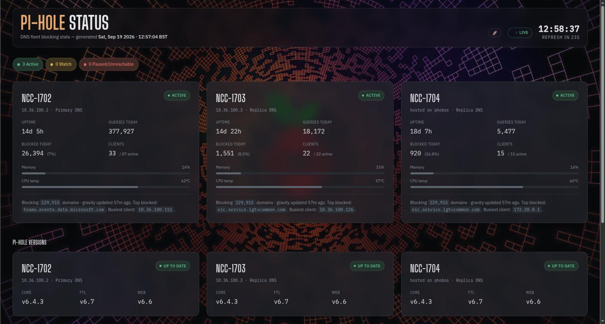

# Pi-hole Status

`piholes.xmsystems.co.uk` — a three-panel DNS fleet status board, regenerated
every minute. Think of it as a website version of PADD, but covering all
three Pi-holes at once instead of one 7" screen.



The page sits over a full-page DNS/network-themed background image, with a
`🚀 BACKGROUND` toggle in the header (persisted via `localStorage`) to strip
it back to a plain solid background. The masthead, panels, footer, and
comparison table are translucent "scrim" glass panels with
`backdrop-filter: blur()` so the image shows through — the same treatment
later reused on Storage Monitor, Update Status, and Server Health, all of
which borrowed this page's card/button styling as their shared template.

## What it shows

A summary legend at the top (**Active** / **Watch** / **Paused/Unreachable**
counts), then one panel per Pi-hole (NCC-1702, NCC-1703, NCC-1704):

- Status pill — Active / Watch / Paused / Unreachable
- Uptime, queries today, blocked today (count + %), active/total clients
- Memory and CPU temperature meters
- Gravity size and freshness, top blocked domain, busiest client

Below the panels, a **Cross-fleet comparison** table lines all three up side
by side.

## Status thresholds

| Status | Trigger |
| --- | --- |
| **Active** | None of the below |
| **Watch** | CPU temp ≥ 75°C, **or** memory usage ≥ 90%, **or** gravity list hasn't updated in over 36 hours |
| **Paused** | Blocking is disabled on that Pi-hole |
| **Unreachable** | Its v6 REST API didn't respond |

The 36-hour gravity threshold is deliberately generous — nebula-sync runs
gravity updates hourly, so a gap that long usually means sync itself is
stuck, not just a slow cycle.

## How it works

```text
Cron (Phobos, every minute)
  └─▶ generate-piholestatus.sh
        ├─▶ https://ncc-1702.xanderman.co.uk/api/...  (primary DNS)
        ├─▶ https://ncc-1703.xanderman.co.uk/api/...  (replica DNS)
        └─▶ https://ncc-1704.xanderman.co.uk/api/...  (replica, runs on phobos itself)
              └─▶ writes piholestatus.html straight into nginx's docroot on Phobos
                    └─▶ nginx (Phobos, Docker) serves it
                          └─▶ Traefik (Titan, `websecure-int`) → piholes.xmsystems.co.uk
```

Like [Server Health](moon-fleet.md), this is a static HTML snapshot with no
backend API and no client-side JS polling — unlike [Storage
Monitor](storage.md), which polls live. `generate-piholestatus.sh` talks
directly to each Pi-hole's own v6 REST API (`/api/stats/summary`,
`/api/dns/blocking`, `/api/info/system`, `/api/info/sensors`, etc.) — no SSH,
no auth needed, since none of the three Pi-holes has a password set. The
1-minute cadence (vs. Server Health's 4 hours) matches how fast Pi-hole
stats actually change.

- Source: `generate-piholestatus.sh` in the `pihole-status` repo
  (`/home/xander/scripts/pihole-status` on Phobos).
- Cron: `* * * * * /home/xander/scripts/pihole-status/generate-piholestatus.sh >> /home/xander/scripts/pihole-status/piholestatus.log 2>&1`
- A Pi-hole that can't be reached renders as an "Unreachable" panel rather
  than breaking the rest of the page.

!!! note "Running it on demand"
    ```bash
    ssh phobos /home/xander/scripts/pihole-status/generate-piholestatus.sh
    ```
    Useful straight after a config change you don't want to wait up to a
    minute to see reflected.

!!! note "Editing the page's HTML/CSS"
    Like Server Health, `piholestatus.html` is regenerated from scratch on
    every cron run, so a direct edit to the file on Phobos gets overwritten
    within a minute. Styling and markup changes belong in the heredoc
    template inside `generate-piholestatus.sh` — edit the script, then run
    it once on demand (above) to deploy immediately.

!!! note "The background image"
    `piholes-bg.jpg` (a DNS/network code visualisation) isn't tracked in the
    repo — it's a personal image file living at
    `/ssd/docker/appdata/nginx/piholes-bg.jpg` on Phobos, alongside
    `piholestatus.html`. If Phobos's nginx docroot is ever rebuilt from
    scratch, this file needs copying back manually. An earlier version used
    a USS Enterprise NCC-1701 render instead (a nod to the NCC-1702/1703/1704
    fleet); an even earlier attempt tried embedding a live pixel-art
    visualiser ([ph-intercept](ph-intercept.md)) as an animated iframe
    background, reverted after its game/HUD layer turned out to never
    render when framed cross-origin.

## Fleet

| Pi-hole | Role | API base |
| --- | --- | --- |
| NCC-1702 | Primary DNS | `https://ncc-1702.xanderman.co.uk` |
| NCC-1703 | Replica DNS | `https://ncc-1703.xanderman.co.uk` |
| NCC-1704 | Replica DNS (runs on Phobos) | `https://ncc-1704.xanderman.co.uk` |

All three are kept in sync (gravity, DNS records, DHCP, etc.) by
nebula-sync, which runs on Phobos and syncs from NCC-1702 hourly.

## Troubleshooting

- **A panel shows "Unreachable"** — that Pi-hole's v6 REST API isn't
  responding; check the container/service is up and reachable from Phobos.
  The other two panels are unaffected.
- **Page looks stale** — check `crontab -l` on Phobos for the
  `generate-piholestatus.sh` line, and tail
  `/home/xander/scripts/pihole-status/piholestatus.log` for the last run's
  output/errors.
- **A Pi-hole is stuck on "Watch" for gravity age after a sync fixed it** —
  gravity freshness is read at generation time; the next minute's cron run
  picks up the corrected timestamp automatically.

## Related

- [Server Health](moon-fleet.md) — same static-snapshot pattern, but a
  4-hour cadence across all five hosts instead of a 1-minute cadence across
  the DNS fleet
- [Storage Monitoring](storage.md) — live-polled dashboard, same visual
  theme
- [Automatic Container Updates](container-updates.md) — same visual theme, weekly per-host update dashboard
- [PH-Intercept](ph-intercept.md) — the live pixel-art DNS visualiser once
  trialled (and reverted) as this page's background
