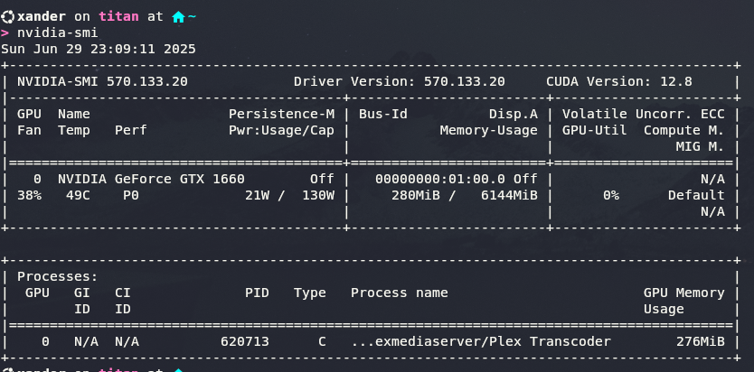

Having access to all of my Films, TV Shows & Music wherever I am and on whatever device I'm using is really what started my journey down this rabbit hole 

Installation of Plex is done as part of a docker-compose stack with Overseerr

With me having an Nvidia gfx card, I utilise this for transcoding.  
This requires the necessary drivers installing and also the correct config adding into the docker-compose file.



### docker-compose.yml

``` yaml
networks:
  default:
    name: proxy
    external: true

services:

  plex:
    image: plexinc/pms-docker
    container_name: plex
    hostname: Titan
    volumes:
      - /ssd/docker/appdata/Plex:/config
      - /megaraid/mediastore/Movies:/movies:ro
      - /megaraid/mediastore/StandUp:/standup:ro
      - /megaraid/mediastore/TV:/tv:ro
      - /megaraid/mediastore/Formula1:/F1:ro
    networks:
      default:
        ipv4_address: 172.19.0.100
    devices:
      - /dev/dri:/dev/dri
    restart: unless-stopped
    environment:
      - PGID=1000
      - PUID=1000
      - TZ=Europe/London
      - VERSION=docker
      - ADVERTISE_IP=https://subdomain.domain.co.uk:443
    ports:
      - 32400:32400/tcp
      - 32469:32469/tcp
      - 1900:1900/udp
      - 32410:32410/udp
      - 32412:32412/udp
      - 32413:32413/udp
      - 32414:32414/udp
    labels:
      - traefik.enable=true
      - traefik.http.services.plex.loadbalancer.server.port=32400
      - traefik.http.routers.plex.rule=Host(`subdomain.domain.co.uk`)
      - traefik.http.routers.plex.entrypoints=websecure-ext
      - traefik.http.routers.plex.tls=true
      - traefik.http.routers.plex.tls.certresolver=production
      - traefik.http.routers.plex.tls.domains[0].main=domain.co.uk
      - traefik.http.routers.plex.tls.domains[0].sans=*.domain.co.uk
```
