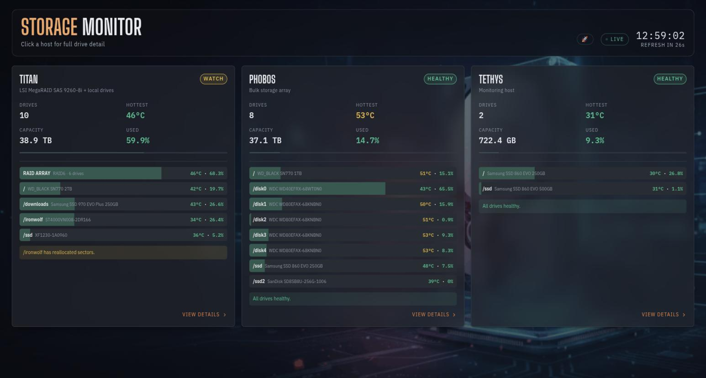

# Storage Monitor

`storage.xmsystems.co.uk` — live RAID health dashboard for Titan's LSI MegaRAID SAS 9260-8i controller.



## What it shows

### Controller

- Model, serial, firmware and package version
- Memory error counts (correctable / uncorrectable)
- BBU (battery backup unit) status
- Alarm state

### Array (Virtual Drive)

- RAID level, capacity, access mode, cache policy
- Filesystem usage: used / free / total space, mount point, filesystem type and backing device

### Physical Drives

For each disk in the array:

- Slot ID and online/offline/rebuilding state
- Model, serial, capacity, interface and link speed
- Temperature, with a colour-coded gauge (cyan → green → amber → orange → red as it heats up)
- Error counters: media errors, other errors, BBM errors, predictive failure, S.M.A.R.T. status
- Power-on hours

Drives with any error flags raised get a highlighted red border so they stand out from the grid at a glance.

### Other Drives (non-RAID)

Below the RAID section, a second **OTHER DRIVES** panel covers every disk that sits on a plain SATA/NVMe controller rather than behind the MegaRAID card — Titan's `/ironwolf`, `/ssd`, `/downloads` and root, plus all of Phobos's `/disk0`–`/disk4`, `/ssd`, `/ssd2` and root. Grouped by **host**, then by **type** (NVMe → SSD → Mechanical), with each drive labelled by its **mount point** rather than its `/dev/sdX` name (device letters aren't stable across reboots).

Per drive:

- Model, serial, capacity, mount point and underlying `/dev` path
- S.M.A.R.T. overall pass/fail
- Temperature, same colour-coded gauge as the RAID drives
- Power-on hours
- Filesystem usage (used / free, colour-coded)
- Error counters, which differ by drive type:
    - **ATA (SSD/mechanical):** reallocated sectors, pending sectors, uncorrectable sectors
    - **NVMe:** critical warning flag, media errors, percentage used (wear), available spare vs. threshold

## How it works

```bash
Browser
  ├─▶ storage.xmsystems.co.uk/api/
  │     └─▶ nginx (Phobos, Docker)
  │           └─▶ proxy_pass → 10.36.100.150:9877
  │                 └─▶ megaraid-api (Titan, systemd)
  │                       └─▶ MegaRAID controller (via storcli/perccli)
  │
  ├─▶ storage.xmsystems.co.uk/api/disks/titan/
  │     └─▶ nginx (Phobos, Docker)
  │           └─▶ proxy_pass → 10.36.100.150:9878
  │                 └─▶ disk-smart-api (Titan, systemd)
  │                       └─▶ smartctl -a -j <device>
  │
  └─▶ storage.xmsystems.co.uk/api/disks/phobos/
        └─▶ nginx (Phobos, Docker)
              └─▶ proxy_pass → 10.36.100.151:9878
                    └─▶ disk-smart-api (Phobos, systemd)
                          └─▶ smartctl -a -j <device>
```

- The frontend is a single static page (`megaraid.html`) served by nginx on Phobos.
- nginx proxies `/api/` to `megaraid-api` on Titan (port 9877) for the RAID section, and `/api/disks/titan/` + `/api/disks/phobos/` to a `disk-smart-api` instance on each host (port 9878, internal only) for the non-RAID section.
- `disk-smart-api` is a small Python systemd service — one instance per host — that runs `smartctl -a -j` against a fixed, hand-maintained device → mount-point map (`/etc/systemd/system/disk-smart-api.service` → `/usr/local/bin/disk-smart-api`), classifies each drive as `nvme` / `ssd` / `mechanical` (NVMe by `device.type`, otherwise SSD vs. mechanical by `rotation_rate`), and returns controller-free JSON: model, serial, capacity, S.M.A.R.T. status, temperature, power-on hours, type-specific error counters, and filesystem usage. Response is cached 30s, same as `megaraid-api`.
- The page polls all three endpoints every 30 seconds (`cache: 'no-store'`) and re-renders in place. The two `disk-smart-api` calls are independent of the RAID call (`Promise.allSettled`) — if one host's SMART API is down, the RAID section and the other host's drives keep updating normally.

!!! note "Adding a new drive"
    There's no auto-discovery — `disk-smart-api` reads from a static `DEVICES` dict in `/usr/local/bin/disk-smart-api` on the relevant host (`{"/dev/sdX": "/mount/point", ...}`). Add the new device/mount pair there and `systemctl restart disk-smart-api`.

## Status colours

| Colour | Meaning |
| --- | --- |
| Green (`OPTIMAL` / `ONLINE` / `HEALTHY`) | Healthy |
| Amber/Yellow | Degraded, rebuilding, or a warning-level condition |
| Red | Critical — offline, failed, S.M.A.R.T. failure, or an error counter above zero |

## Troubleshooting

- **"Could not reach Titan API"** banner — the `megaraid-api` systemd service on Titan is down, or the nginx proxy to `10.36.100.150:9877` is failing. The page keeps showing the last known good data while it retries.
- **A host's "OTHER DRIVES" group is missing or stale** — check `systemctl status disk-smart-api` on that host, and that its nginx proxy target (`10.36.100.150:9878` for Titan, `10.36.100.151:9878` for Phobos) is reachable. Unlike the RAID banner, a failed `disk-smart-api` call fails silently (that host's group just doesn't render) rather than showing an error banner.
- **Duplicated info after refresh** — historical bug in the array-storage render (fixed: it was appending a new usage block into the card instead of replacing it).
