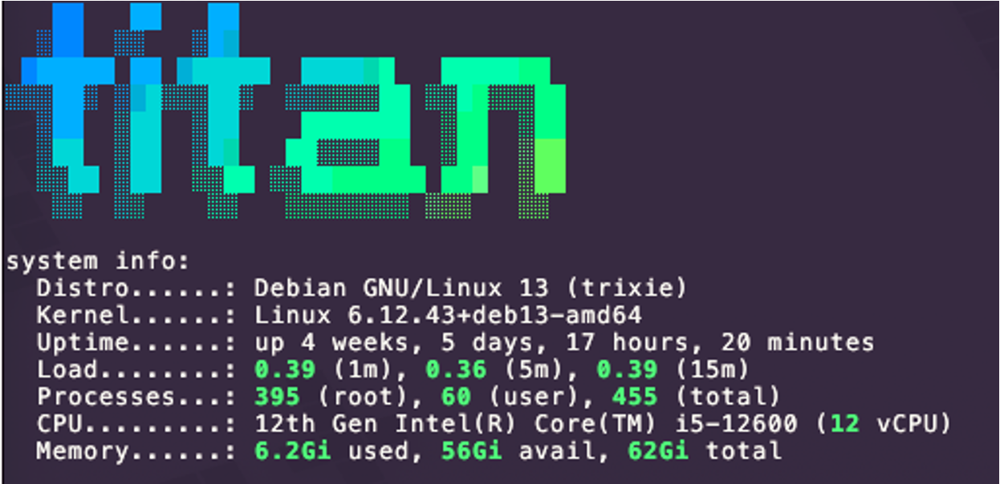

TiTAN is my primary server and is where the majority of my media and services live.

This is my old gaming rig and resides in a Fractal Define R4 case

**Specs**

- Intel i5 12600 CPU (alder lake)  
- Asus PRIME B660M-A D4 Motherboard  
- 64GB Corsair Vengance 3200mHz RAM (4x16GB)
- LSI Megaraid SAS 9260-8i RAID card
    - 6 X 8TB Seagate SAS drives 
        Configured in a RAID6 array 
        Mounted as /megaraid
- 1 X 2TB NVME WD BLACK SN770  
    - Used for the OS
- 1 X 1TB Seagate SSD 
    - Used for appdata  
        Mounted as /ssd  
- 1 X 4TB Seagate Ironwolf drive
        Mounted as /ironwolf
- Corsair RM850x PSU

**Operating System**

Running Debian 13 (trixie)