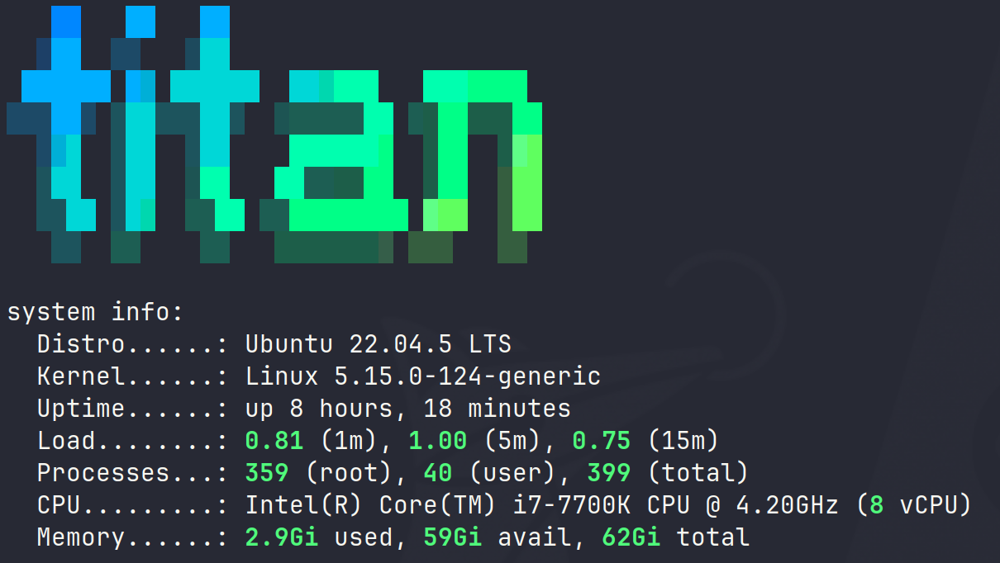

TiTAN is my primary server and is where the majority of my media and services live.

This is my old gaming rig and resides in a Fractal Define R4 case

**Specs**

- Intel i7 7700k CPU (kaby lake)  
- Asus Z270 Gaming Motherboard  
- 64GB Corsair Vengance 3200mHz RAM (4x16GB)  
- Megaraid RAID card  
- 2 X 1TB Seagate SSD's   
    - 1 for OS 
    - 1 for my appdata  
        - Mounted as /ssd  
- 1 X 4TB Seagate Ironwolf drive
    - Mounted as /ironwolf  
- 6 X 8TB Seagate SAS drives 
    - Configured in a RAID6 array 
    - Mounted as /megaraid  
- Corsair RM850x PSU  

**Operating System**

My operating system of choice is Ubuntu Server  
Current version - 22.04.4 LTS
