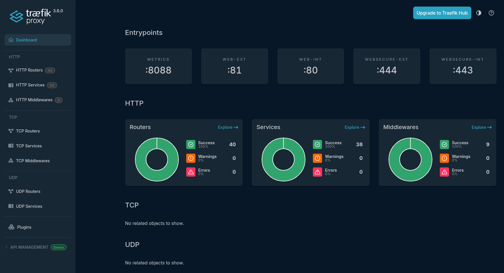
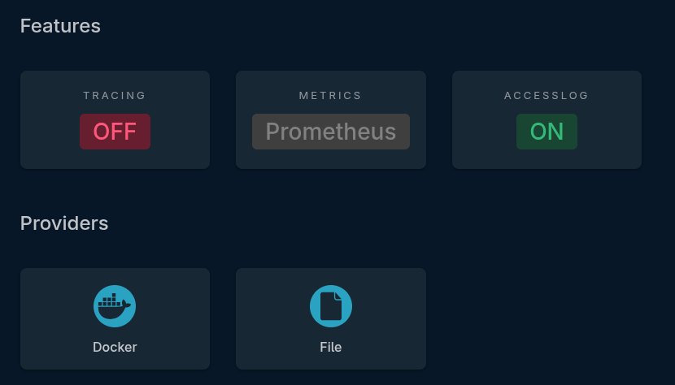

Traefik is the beating heart of my homelab.  Every connection comes into traefik which then routes the traffic to the application being requested/served

I have a domain with Cloudflare and have created subdomains for all of my services.  
It also uses Lets Encrypt and provides a valid SSL certificate  


With Traefik, I also have the abillity to specify multiple entry points (2 internal and 2 external)  This allows me to keep my internal services internal and only have my external services showing to the world.  
The section [Traefik Entry Points](https://docs.xmsystems.co.uk/entrypoints/) will explain more about these.

### docker-compose.yml

Below is the Docker Compose file (you will notice this also includes [Portainer](https://docs.xmsystems.co.uk/portainer/))
Sensitive information is placed in a hidden .env file which is then referenced within the docker-compose.

``` yaml
networks:
  default:
    name: proxy
    external: true

services:

  traefik:
    image: traefik:3.1.0-rc3
    container_name: traefik
    restart: always
    networks:
      default:
        ipv4_address: "172.19.0.2"
    ports:
      - 80:80
      - 81:81
      - 443:443
      - 444:444
      - 8088:8088
    environment:
      - CF_API_EMAIL=${CF_API_EMAIL}
      - CF_DNS_API_TOKEN=${CF_DNS_API_TOKEN}
    volumes:
      - /etc/localtime:/etc/localtime:ro
      - /var/run/docker.sock:/var/run/docker.sock:ro
      - /ssd/appdata/traefik/data/traefik.yml:/traefik.yml:ro
      - /ssd/appdata/traefik/data/acme.json:/acme.json
      - /ssd/appdata/traefik/dynamic:/ssd/appdata/traefik/dynamic
      - traefik-logs:/var/log/traefik
    labels:
      - traefik.enable=true
      - traefik.http.routers.traefik_https.rule=Host(`subdomain.domain.co.uk`)
      - traefik.http.routers.traefik_https.entrypoints=websecure-int
      - traefik.http.routers.traefik_https.tls=true
      - traefik.http.routers.traefik_https.tls.certresolver=production
      - traefik.http.routers.traefik.tls.domains[0].main=domain.co.uk
      - traefik.http.routers.traefik.tls.domains[0].sans=*.domain.co.uk
      - traefik.http.routers.traefik_https.service=api@internal

  portainer:
    image: portainer/portainer-ee:2.19.5
    container_name: portainer
    networks:
      default:
        ipv4_address: "172.19.0.3"
    command: -H unix:///var/run/docker.sock
    restart: always
    volumes:
      - /var/run/docker.sock:/var/run/docker.sock
      - portainer_data:/data
    labels:
      - traefik.enable=true
      - traefik.http.services.portainer.loadbalancer.server.port=9000
      - traefik.http.routers.portainer.rule=Host(`subdomain.domain.co.uk`)
      - traefik.http.routers.portainer.entrypoints=websecure-int
      - traefik.http.routers.portainer.tls=true
      - traefik.http.routers.portainer.tls.certresolver=production
      - traefik.http.routers.portainer.tls.domains[0].main=domain.co.uk
      - traefik.http.routers.portainer.tls.domains[0].sans=*.domain.co.uk

volumes:
  portainer_data:
  traefik-logs:
```

### traefik.yml

The traefik.yml file lives inside the "data" directory and is used to: 

enable/disable the dashboard, define entry points, assign middleware at a global level (rather than at an application level), specify your certificate resolver details, detail your docker provider and the docker socket address aswell as dynamic files/directory location.  Finally you can also, optionally, provide the location of log files and details of any collector of metrics.


``` yaml
global:
  checkNewVersion: true
  sendAnonymousUsage: false

api:
  dashboard: true
  debug: true

entryPoints:
#internal
  web-int:
    address: :80
    http:
      redirections:
        entryPoint:
          to: websecure-int
          scheme: https
  websecure-int:
    address: :443
    http:
      middlewares:
        - global-default-headers@file
#external
  web-ext:
    address: :81
    http:
      redirections:
        entryPoint:
          to: websecure-ext
          scheme: https
  websecure-ext:
    address: :444
    http:
      middlewares:
        - global-default-headers@file
  metrics:
    address: :8088

certificatesResolvers:
  production:
    acme:
      email: <e-mail address>>
      storage: acme.json
      dnsChallenge:
        provider: cloudflare
        resolvers:
          - "1.1.1.1:53"
          - "1.0.0.1:53"

serversTransport:
  insecureSkipVerify: true

providers:
  docker:
    endpoint: "unix:///var/run/docker.sock"
    exposedByDefault: false
  file:
    directory: /ssd/appdata/traefik/dynamic/
    watch: true

log:
  level: "INFO"
  filePath: "/var/log/traefik/traefik.log"

accessLog:
  filePath: "/var/log/traefik/access.log"

metrics:
  prometheus:
    addRoutersLabels: true
    addServicesLabels: true
    entryPoint: metrics
    buckets:
        - 0.1
        - 0.3
        - 1.2
        - 5.0
```
### Traefik Dashboard

*Care should be taken to ensure you are not exposing your dashboard to the wider internet.*

The dashboard will allow you to see the entrypoints and ports configured, browse your configured routers, services and middlewares whilst also giving you an at a glance view of what's configured successfully and what's not.



The lower portion of the dashboard will also show you your configured features and providers



### Dynamic Files Directory

Traefik will allow you to provide a single file as a provider of Routers, Middlewares and Services.

What I have selected to do, as you will see in the Dynamic Files section, is specify a directory where multiple dynamic files can be placed and this directory is watched by Traefik for new files and/or changes to existing files.

Dynamic files can be very useful for services that are running on other hosts and are/aren't running in docker

As its "dynamic" you can make changes to these files and they will instantly take effect without needing to restart traefik

The section [Traefik Dynamic Files](https://docs.xmsystems.co.uk/dynamic/) goes into more detail about these files and shows examples.
