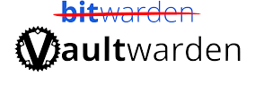
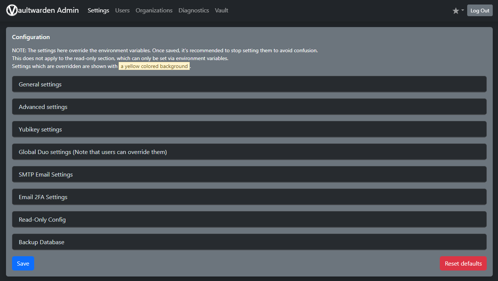

  

Vaultwarden is an alternative implementation of Bitwarden server API which is able to be self-hosted.

It is compatible with Bitwarden Clients

Features included:

- Organizations support
- Attachments and Send
- Vault API support
- Serving the static files for Vault interface
- Website icons API
- Authenticator and U2F support
- YubiKey and Duo support
- Emergency Access

##docker-compose.yml

```yaml
networks:
  default:
    name: cuthbert-network
    external: true

services:
  vaultwarden:
    image: vaultwarden/server:latest
    container_name: vaultwarden
    networks:
      default:
        ipv4_address: "172.22.0.11"
    restart: always
    ports:
      - 83:80
    volumes:
      - /home/xander/appdata/Vaultwarden/data:/data
    environment:
      - ADMIN_TOKEN=<hashed string using argon2>
      - DOMAIN=https://sudomain.domain.co.uk
```
###Dynamic File

The dynamic file for Vaultwarden is located [here](https://docs.xanderman.co.uk/dynamic/#vaultwarden-cuthbert)

##Clients

Clients can be either a desktop app, a mobile app or even a browser extention.

Each are configured to point to the self-hosted URL  
Upon entering the Master Password, this then allows access to the data stored which is not just passwords,  I also hold various other sensitive information such as license keys and PIN numbers.  
Features offered within the clients offer the abillity to "autofill" fields whenever there is a match detected.

##Admin Page

This page allows a server administrator to view all the registered users and to delete them. It also allows inviting new users, even when registration is disabled.

To enable the admin page, you need to set an authentication token. This token can be anything, but it's recommended to use a long, randomly generated string of characters

More information about this and everything else Vaultwarden is detailed in their [Wiki](https://github.com/dani-garcia/vaultwarden/wiki)



